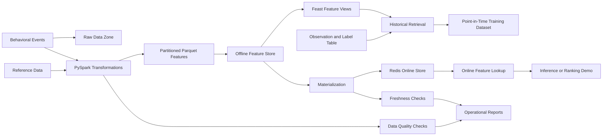

# FeatureForge Architecture

## Purpose

FeatureForge provides a shared feature platform for offline model training and
low-latency online inference.

The architecture is designed to prevent training-serving skew, future-data
leakage, stale online features, and unreproducible backfills.

## High-Level Data Flow



## Components

### Raw Data Zone

Contains deterministic synthetic behavioral events and reference datasets.

Examples:

- users
- content catalog
- behavioral events
- observations and labels

### PySpark Transformations

PySpark transforms event data into feature datasets.

The transformations must be:

- event-time aware
- deterministic
- idempotent
- testable
- parameterized by a time range

### Offline Feature Store

The offline storage profile uses partitioned Parquet data.

Expected production profile:

```text
s3://featureforge/
  raw/
  offline/
    feature_view=user_engagement/
      event_date=YYYY-MM-DD/
  observations/
  manifests/
```

The offline store is used for:

- historical feature retrieval
- training dataset generation
- backfills
- audits
- reproducibility

### Feast

Feast provides:

- entities
- data sources
- feature views
- feature services
- historical retrieval
- online materialization
- online feature lookup

Feature definitions are maintained as code and versioned through Git.

### Online Feature Store

Redis is used for local development because it provides a simple low-latency
key-value store that can run reproducibly through Docker Compose.

DynamoDB is the documented AWS production alternative.

## Temporal Correctness

Historical retrieval must only use feature values that were available at or
before the observation timestamp.

A future-data leakage test is mandatory.

If an event occurs after an observation timestamp, that event must not influence
the feature value retrieved for that observation.

## Materialization

Materialization moves current feature values from the offline store into the
online store.

The process must support:

- full materialization
- incremental materialization
- retry-safe execution
- freshness reporting
- structured run manifests

## Data Quality

Before materialization, FeatureForge will validate:

- required schema
- non-null entity keys
- duplicate entity/timestamp pairs
- valid feature ranges
- referential integrity
- input volume anomalies
- feature freshness

Failed quality checks must block materialization.

## Reliability Principles

- Prefer idempotent jobs.
- Make time boundaries explicit.
- Make data contracts executable.
- Fail before invalid data reaches serving.
- Record run metadata.
- Keep local development reproducible.
- Document production trade-offs.

## V1 Non-Goals

The first version intentionally does not include:

- Kafka or Flink
- Kubernetes
- Terraform-heavy infrastructure
- A complex ML model
- Multiple microservices
- Production-scale distributed serving

These topics belong to later roadmap projects or extensions.