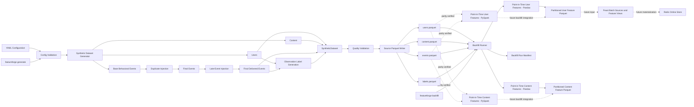

# FeatureForge Architecture

## Purpose

FeatureForge is a production-inspired feature platform for reproducible offline
training data and future low-latency online ML feature serving.

The project is designed to prove end-to-end Data Infrastructure, Feature
Infrastructure, and ML Platform Engineering fundamentals:

- executable data contracts
- deterministic synthetic data generation
- event-time-aware feature computation
- point-in-time correctness
- partitioned offline feature datasets
- reproducible, date-parameterized backfills
- auditable run metadata
- quality validation and automated tests
- engine-independent feature correctness (Pandas and PySpark parity)

The longer-term architecture will build on this foundation to prevent
training-serving skew, future-data leakage, stale online features, and
unreproducible backfills.

## Current Architecture



## Current Data Flow

FeatureForge currently provides two executable local flows, plus a
parity-tested second execution engine for feature computation.

### Synthetic Dataset Generation

```text
YAML configuration
        ↓
configuration validation
        ↓
deterministic synthetic dataset generation
        ↓
duplicate and late-event injection
        ↓
observation-label generation
        ↓
quality validation
        ↓
source Parquet datasets
        ↓
generation run manifest
```

Run the generation flow:

```bash
featureforge generate \
  --config configs/synthetic_data.yaml \
  --output output/source_data
```

### Offline Feature Backfill

```text
source Parquet datasets
        ↓
read SyntheticDataset
        ↓
inclusive date-range iteration
        ↓
UTC observation timestamp per day
        ↓
point-in-time user feature aggregation
        ↓
point-in-time content feature aggregation
        ↓
partitioned Parquet feature datasets
        ↓
backfill run manifest
```

Run an offline feature backfill:

```bash
featureforge backfill \
  --input output/source_data \
  --output output/offline_store \
  --start-date 2026-03-10 \
  --end-date 2026-03-12 \
  --window-days 7
```

## Components

### Configuration

`SyntheticDataConfig` loads and validates YAML configuration before data
generation begins.

The configuration controls:

- random seed
- synthetic-data time range
- number of users, content items, base events, and observations
- duplicate event rate
- late-event rate
- maximum late-arrival duration
- label horizon

Configuration validation fails early when inputs are invalid.

Examples of enforced rules:

- `end_time` must be after `start_time`
- event rates must be between `0.0` and `1.0`
- entity and event counts must be positive
- `max_late_arrival_hours` must be greater than zero when
  `late_event_rate` is positive

### Synthetic Data Generation

The synthetic-data module generates deterministic, production-inspired
behavioral data.

Every generation stage uses a separate random-number-generator seed derived
from the configured base seed. This makes complete runs reproducible while
keeping individual stages independent.

The current generator produces:

- users
- content catalog entries
- base behavioral events
- duplicate event deliveries
- late-arriving events
- observation labels

For the same configuration and seed, FeatureForge produces the same entities,
events, labels, and source Parquet output structure.

### Users and Content

Users and content items are independent reference datasets.

User records include:

- `user_id`
- `signup_at`
- `country`
- `plan_tier`
- `acquisition_channel`

Content records include:

- `content_id`
- `title`
- `genre`
- `released_at`
- `duration_seconds`

Event and label records reference generated user IDs. Non-search events also
reference generated content IDs.

### Behavioral Events

Base events represent normal deliveries of behavioral activity.

Supported event types are:

- `impression`
- `click`
- `play`
- `watch`
- `like`
- `search`

A search event has no content reference:

```text
event_type=search
content_id=None
```

Watch-duration semantics are explicit:

```text
event_type in {play, watch}  -> watch_seconds > 0
all other event types        -> watch_seconds == 0
```

### Duplicate Injection

Duplicate injection models repeated delivery of the same behavioral event.

A duplicate event:

- receives a unique delivery ID with a `_duplicate_XX` suffix
- has `is_duplicate=True`
- preserves the original behavioral payload
- does not replace or mutate the original event
- is appended as an additional event delivery

Example:

```text
original:
event_id=event_00000042
is_duplicate=false

duplicate:
event_id=event_00000042_duplicate_01
is_duplicate=true
```

This allows downstream quality checks and later transformations to test
deduplication behavior explicitly.

### Late-Event Injection

Late-event injection models events that occurred at one time but arrive at the
platform later.

A late event:

- preserves its original `event_time`
- receives a later `ingested_at`
- has `is_late=True`
- keeps all behavioral payload fields unchanged
- has a delay bounded by `max_late_arrival_hours`

Late-event injection returns a new event collection and leaves the input
collection unchanged.

### Observation Labels

Observation labels convert behavioral events into an ML-oriented target.

Each label answers:

> Did this user have at least one behavioral event during the configured future
> label window?

A label contains:

- `label_id`
- `user_id`
- `observation_time`
- `label_window_end`
- `is_active_next_7d`

The configured label horizon determines the window end:

```text
label_window_end = observation_time + label_horizon_days
```

The target is calculated with event time:

```text
observation_time < event_time <= label_window_end
```

Labels represent future user behavior, not the time at which the platform
received an event.

### Feature Contracts

FeatureForge currently exposes two point-in-time feature contracts.

#### User Engagement Features

`UserEngagementFeatures` is computed once per `user_id` for an observation
timestamp and lookback window.

Current fields:

- `event_count`
- `unique_content_count`
- `total_watch_seconds`
- `search_count`
- `play_count`
- `watch_count`
- `days_since_last_activity`

`UserFeatureBatch` validates that all rows share one observation time and one
window size.

#### Content Popularity Features

`ContentPopularityFeatures` is computed once per `content_id` for an
observation timestamp and lookback window.

Current fields:

- `view_count`
- `unique_viewer_count`
- `total_watch_seconds`
- `average_watch_seconds`
- `search_count`
- `play_count`
- `watch_count`
- `days_since_last_view`

`ContentFeatureBatch` validates that all rows share one observation time and
one window size.

### Point-in-Time Feature Computation

The feature layer contains domain logic only. It does not know about CLI
arguments, directory paths, or Parquet storage.

Both current feature functions accept:

```python
dataset
observation_time
window_days
```

The event window is:

```text
(observation_time - window_days, observation_time]
```

That means:

- events at the lower boundary are excluded
- events at the observation timestamp are included
- events after the observation timestamp are excluded
- each feature record carries its `observation_time` and `window_days`

This explicit event-time contract prevents future events from entering a
feature value computed as of an earlier observation timestamp.

## PySpark Parity Layer

FeatureForge now includes a second execution engine for both feature views:
`src/featureforge/spark_features.py`.

This module does not introduce new feature semantics. It computes the exact
same `UserEngagementFeatures` and `ContentPopularityFeatures` contracts as
`src/featureforge/features.py`, using PySpark DataFrames instead of Pandas.

### Why a Second Engine Exists

The Pandas implementation is the correctness reference. It is simple, easy to
read, and easy to verify by hand. It does not scale past a single process,
however, and every future Spark ETL job in this project must produce results
that are provably identical to that reference — not merely similar.

Introducing the Spark engine now, while the dataset is still small and fully
understood, keeps the migration honest: any discrepancy between the two
engines is a bug to find today, not a silent correctness regression to
discover later at production scale.

### Parity Testing Strategy

`tests/unit/test_spark_features.py` never re-validates feature *semantics* —
that is already covered by `tests/unit/test_features.py`. It validates
*engine equivalence*: that `compute_user_engagement_features_spark` and
`compute_content_popularity_features_spark` return batches that are equal,
field for field, to their Pandas counterparts, across:

- empty datasets
- exact window-boundary events (`observation_time`, `observation_time + 1s`,
  `observation_time - window_days`)
- typed event-count aggregation across multiple users and content items
- `average_watch_seconds` floating-point division
- randomized datasets with hundreds of events across many entities
- identical rejection of non-positive `window_days`

A parity suite is only useful if it can actually fail. Early runs of this
suite did fail, and the failure was informative rather than a test-authoring
mistake — see below.

### A Real Timezone Bug, and Why the Fix Is Structural

The first working version of `spark_features.py` passed Python `datetime`
objects with `tzinfo=UTC` directly into a Spark DataFrame using
`TimestampType`. Four of the nine parity tests failed with a **consistent
one-hour offset** in `days_since_last_activity` and `days_since_last_view`.

The root cause: Spark's `TimestampType` round-trips through the JVM during
Python-to-JVM and JVM-to-Python conversion (via py4j/Arrow). That conversion
path is independent of the `spark.sql.session.timeZone` SQL setting — setting
it to `"UTC"` did not fix the offset. The conversion instead depends on the
JVM's default timezone, which is inherited from the host machine's local
timezone. On a machine whose local timezone is not UTC, this silently shifts
timestamps by the local UTC offset during the Python-to-JVM-to-Python
round-trip.

This is exactly the class of bug that a feature platform must catch before it
reaches training data: not a crash, but a quietly wrong `days_since_last_view`
value that would still validate against every Pydantic constraint.

**The fix removes the ambiguity at the source instead of patching it after
the fact.** `spark_features.py` never hands a `datetime` object to Spark.
Every `event_time` is converted to UTC epoch microseconds — a plain
`LongType` integer — before entering Spark, and converted back to a
timezone-aware UTC `datetime` only after `collect()`:

```python
def _to_epoch_micros(value: datetime) -> int:
    if value.tzinfo is None:
        raise ValueError("event_time must be timezone-aware")
    return int(value.astimezone(UTC).timestamp() * 1_000_000)

def _from_epoch_micros(value: int) -> datetime:
    return datetime.fromtimestamp(value / 1_000_000, tz=UTC)
```

An integer has no timezone to misinterpret. The window filter in
`_filter_window` compares epoch-microsecond longs directly, so the point-in-time
boundary `(observation_time - window_days, observation_time]` is evaluated
without ever depending on how Spark or the JVM would otherwise interpret a
timestamp column.

This is the same lesson production Spark pipelines learn the hard way: never
trust `TimestampType` round-trips to be timezone-safe across machines. Encode
time as UTC epoch integers at every system boundary instead.

### Current Parity Guarantee

```text
featureforge.features.compute_user_engagement_features
    ==
featureforge.spark_features.compute_user_engagement_features_spark

featureforge.features.compute_content_popularity_features
    ==
featureforge.spark_features.compute_content_popularity_features_spark
```

Both equalities are enforced by automated tests on every run, not asserted
by inspection. Any future change to either engine that breaks this equality
fails the test suite before it can reach a backfill or a Feast batch source.

### What This Enables Next

The Spark engine currently runs locally against in-memory `SyntheticDataset`
objects, the same way the Pandas reference does. It does not yet read
partitioned source Parquet directly, and it is not yet wired into
`run_backfill`. Those are the next two steps before Spark becomes the
production execution path:

1. Read `users.parquet` / `content.parquet` / `events.parquet` directly as
   Spark DataFrames instead of constructing them from an in-memory
   `SyntheticDataset`.
2. Give the backfill runner an engine parameter so the same date-range
   backfill can execute against either the Pandas or the Spark
   implementation, with the manifest recording which engine produced each
   partition.

## Parquet Persistence

The storage layer has two responsibilities.

### Source Dataset Persistence

A `SyntheticDataset` is written to four source Parquet tables:

```text
<output>/
├── users.parquet
├── content.parquet
├── events.parquet
└── labels.parquet
```

Parquet is used because it is columnar, typed, efficient for analytical reads,
and consumable by Pandas, PyArrow, PySpark, and later Feast batch sources.

### Feature Batch Persistence

Feature batches are written into deterministic, partitioned paths:

```text
<output>/
├── user_engagement_features/
│   ├── observation_date=2026-03-10/
│   │   └── features.parquet
│   └── observation_date=2026-03-11/
│       └── features.parquet
├── content_popularity_features/
│   ├── observation_date=2026-03-10/
│   │   └── features.parquet
│   └── observation_date=2026-03-11/
│       └── features.parquet
└── manifests/
    └── backfill-2026-03-10-to-2026-03-11.json
```

The partition key is `observation_date`, because each file represents the
feature state at a specific point in time.

## Backfills

`run_backfill(...)` computes and persists user and content features for an
inclusive date range.

A backfill accepts:

```text
start_date
end_date
window_days
output_dir
```

For every backfill date, FeatureForge constructs this observation timestamp:

```text
YYYY-MM-DDT00:00:00+00:00
```

For example:

```text
observation_date=2026-03-12
observation_time=2026-03-12T00:00:00+00:00
```

The date partition therefore represents features available as of UTC midnight
on that date.

### Idempotency Semantics

Feature backfills use deterministic partition paths:

```text
<output>/<feature_view>/observation_date=YYYY-MM-DD/features.parquet
```

A repeated backfill with the same source data, dates, window, and code
overwrites the same canonical feature partitions. It does not append duplicate
files or create random output names.

The feature-value idempotency contract is tested by running an identical
backfill twice and asserting equal Parquet DataFrames.

The backfill manifest is intentionally updated for the same date range because
it records real execution timestamps.

## Run Manifests

FeatureForge writes machine-readable JSON manifests for both generation and
backfill runs.

A generation manifest includes:

- generation timestamp
- full configuration
- row counts
- quality report
- source output paths

A backfill manifest includes:

- `run_type`
- `started_at`
- `completed_at`
- `status`
- `start_date`
- `end_date`
- `window_days`
- `output_dir`
- one entry per observation-date partition
- user and content feature row counts
- concrete feature output paths

The current deterministic backfill manifest path is:

```text
<output>/manifests/backfill-<start-date>-to-<end-date>.json
```

## Command-Line Interface

FeatureForge currently provides three commands.

Generate source data:

```bash
featureforge generate \
  --config configs/synthetic_data.yaml \
  --output output/source_data
```

Compute a single user-feature snapshot:

```bash
featureforge compute-features \
  --input output/source_data \
  --output output/single_snapshot \
  --observation-time 2026-03-12T00:00:00+00:00 \
  --window-days 7
```

Run a multi-day User-and-Content-feature backfill:

```bash
featureforge backfill \
  --input output/source_data \
  --output output/offline_store \
  --start-date 2026-03-10 \
  --end-date 2026-03-12 \
  --window-days 7
```

## Temporal Correctness

### Event Time and Ingestion Time

FeatureForge explicitly models two clocks:

| Field | Meaning |
|---|---|
| `event_time` | When the user action actually occurred |
| `ingested_at` | When the platform received or processed the event |

For normal base events:

```text
event_time == ingested_at
is_late == false
```

For late events:

```text
ingested_at > event_time
is_late == true
```

The event contract rejects invalid time relationships:

```text
ingested_at < event_time
```

It also rejects a late-event flag without a real ingestion delay:

```text
is_late == true
ingested_at <= event_time
```

### Label-Time Correctness

Labels use `event_time`, not `ingested_at`:

```text
observation_time < event_time <= label_window_end
```

This keeps labels aligned with actual behavior and provides a correct basis for
later point-in-time historical retrieval.

### Feature-Time Correctness

Feature calculations use event time and explicit observation timestamps:

```text
observation_time - window_days < event_time <= observation_time
```

An event after the observation timestamp cannot influence a feature value for
that observation timestamp.

This behavior is tested for both user and content feature views, and now for
both the Pandas and PySpark execution engines identically.

## Data Contracts

Pydantic models provide executable contracts for generated records and feature
outputs:

- `User`
- `Content`
- `Event`
- `ObservationLabel`
- `SyntheticDataset`
- `SyntheticDataConfig`
- `UserEngagementFeatures`
- `UserFeatureBatch`
- `ContentPopularityFeatures`
- `ContentFeatureBatch`

Examples of validated rules include:

- required non-empty identifiers
- valid content duration
- non-negative watch duration
- valid observation windows
- valid event-time and ingestion-time ordering
- configuration-rate bounds
- valid generation time range
- non-negative feature metrics
- typed-event counts that do not exceed total event or view counts
- consistent timestamps and windows inside each feature batch

## Testing Strategy

FeatureForge treats tests as part of the feature contract.

The current suite includes unit and integration coverage for:

- configuration loading and validation
- cross-field validation for late-event settings
- event and label model validation
- deterministic user generation
- deterministic content generation
- deterministic base-event generation
- referential integrity for generated events
- base-event time and watch-duration semantics
- deterministic duplicate injection
- duplicate payload preservation
- duplicate-input immutability
- deterministic late-event injection
- valid late-event delays
- late-event payload preservation
- late-event-input immutability
- deterministic observation-label generation
- label-window correctness
- label values derived from matching events
- full dataset orchestration
- source Parquet file creation and read-back validation
- timestamp and quality-flag preservation in Parquet
- user engagement feature aggregation
- content popularity feature aggregation
- point-in-time feature-window boundaries
- zero-activity feature records
- feature window validation
- inclusive backfill date ranges
- invalid/reversed backfill date ranges
- UTC observation timestamps for daily partitions
- partitioned User and Content feature output
- Parquet feature roundtrips
- idempotent feature-partition outputs
- backfill manifest metadata and partition records
- CLI argument parsing
- CLI generation integration
- CLI backfill integration and idempotency
- Pandas-vs-PySpark parity for user engagement features
- Pandas-vs-PySpark parity for content popularity features
- Pandas-vs-PySpark parity for window-boundary edge cases
- Pandas-vs-PySpark parity for invalid `window_days` rejection

Run the full suite:

```bash
pytest -v
```

Run formatting and lint checks:

```bash
ruff format --check .
ruff check .
```

## Future Architecture

The current local Python/Pandas implementation is the reference path for the
remaining FeatureForge stages. The PySpark engine described above is the first
concrete step of this migration and is already parity-tested against that
reference.


### PySpark Transformations

Future PySpark jobs will transform source behavioral data into scalable feature
tables, building directly on the parity-tested engine already implemented in
`spark_features.py`.

The transformations must be:

- event-time aware
- deterministic
- idempotent
- testable
- parameterized by explicit time ranges
- safe for historical backfills
- validated against the local reference implementation
- timezone-safe across machines (UTC epoch integers at every Spark boundary,
  not `TimestampType` round-trips)

### Offline Feature Store

The planned production-oriented offline profile uses S3-backed partitioned
Parquet data.

```text
s3://featureforge/
├── raw/
├── offline/
│   ├── feature_view=user_engagement_features/
│   │   └── observation_date=YYYY-MM-DD/
│   └── feature_view=content_popularity_features/
│       └── observation_date=YYYY-MM-DD/
├── observations/
└── manifests/
```

The offline store will support:

- historical feature retrieval
- training-dataset generation
- reproducible backfills
- audits
- lineage and feature provenance

### Feast

Feast will provide:

- entities
- batch data sources
- feature views
- feature services
- historical retrieval
- online materialization
- online feature lookup

Feature definitions will remain version-controlled Python code.

### Online Feature Store

Redis is the planned local online store because it supports low-latency
key-value access and runs reproducibly through Docker Compose.

DynamoDB is the documented AWS production alternative.

### Materialization

Materialization will move validated current feature values from the offline
feature store into the online store.

The materialization process must support:

- full materialization
- incremental materialization
- retry-safe execution
- freshness reporting
- structured run manifests
- online/offline parity tests

### Data Quality

Before materialization, FeatureForge will validate:

- required schema
- non-null entity keys
- duplicate entity and timestamp pairs
- valid feature ranges
- referential integrity
- input volume anomalies
- feature freshness

Failed quality checks must block materialization.

## Reliability Principles

- Prefer idempotent jobs.
- Make time boundaries explicit.
- Make data contracts executable.
- Fail before invalid data reaches serving.
- Keep transformations deterministic.
- Preserve input immutability where practical.
- Record run metadata.
- Keep local development reproducible.
- Separate generation, feature computation, storage, and interface concerns.
- Document production trade-offs.
- Never trust implicit timezone handling across process or JVM boundaries.

## V1 Non-Goals

The first version intentionally does not include:

- Kafka or Flink
- Kubernetes
- Terraform-heavy infrastructure
- a complex ML model
- multiple microservices
- production-scale distributed serving

These topics belong to later roadmap projects or future FeatureForge
extensions.
