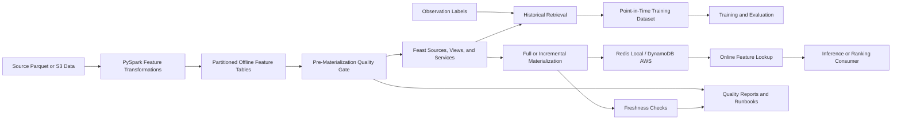

# FeatureForge Architecture

## Purpose

FeatureForge is a production-inspired feature platform for reproducible offline
training data and low-latency online ML feature serving.

The project demonstrates end-to-end Data Infrastructure, Feature
Infrastructure, and ML Platform Engineering fundamentals:

- Executable data contracts
- Deterministic synthetic data generation in independent and behavioral modes
- Event-time-aware feature computation
- Point-in-time correctness
- Partitioned offline feature datasets
- Reproducible, date-parameterized backfills
- Auditable generation, backfill, and materialization manifests
- Data-quality validation and automated tests
- Engine-independent feature correctness through Pandas/PySpark parity
- Feast historical retrieval and online serving
- Full and incremental online materialization into Redis
- Online feature retrieval and deterministic candidate ranking
- ML-ready training pipelines with time-based evaluation
- A reproducible one-command local demonstration

FeatureForge is intentionally local-first. Its goal is not to imitate every
production component, but to prove the contracts, reliability properties, and
operational boundaries that make a feature platform trustworthy.

## Platform Guarantees

FeatureForge currently provides the following verified properties:

| Concern | Current guarantee |
|---|---|
| Reproducibility | Fixed seeds, deterministic output layouts, explicit dates and windows |
| Point-in-time correctness | Features use \( (observation\_time - window, observation\_time] \) |
| Timezone safety | UTC contracts at the Python boundary; Spark uses UTC epoch microseconds |
| Backfill idempotency | Repeated identical runs overwrite deterministic feature partitions |
| Engine correctness | Pandas reference output is parity-tested against PySpark |
| Online serving | Feast materializes user and content feature views into Redis |
| Consumer behavior | Online lookup and ranking use only materialized Feast feature values |
| Operational evidence | JSON manifests record generation, backfill, and materialization runs |
| Developer experience | `docker compose up -d && make demo` runs the local vertical slice |
| Test coverage | Unit and integration tests validate contracts, temporal behavior, and serving |

## Current Architecture

```mermaid
flowchart LR
    Config[YAML Configuration] --> Validate[Config Validation]
    Validate --> Generate[Synthetic Dataset Generator]

    Generate --> Users[Users]
    Generate --> Content[Content]
    Generate --> BaseEvents[Base Behavioral Events]

    BaseEvents --> Duplicate[Duplicate Injection]
    Duplicate --> Late[Late-Event Injection]
    Late --> Events[Delivered Events]

    Users --> Labels[Observation Label Generation]
    Events --> Labels

    Users --> Dataset[SyntheticDataset]
    Content --> Dataset
    Events --> Dataset
    Labels --> Dataset

    Dataset --> Quality[Source Quality Validation]
    Quality --> SourceParquet[Source Parquet Writer]

    SourceParquet --> UsersParquet[users.parquet]
    SourceParquet --> ContentParquet[content.parquet]
    SourceParquet --> EventsParquet[events.parquet]
    SourceParquet --> LabelsParquet[labels.parquet]
    SourceParquet --> GenerationManifest[Generation Manifest]

    UsersParquet --> PandasBackfill[Pandas Backfill Engine]
    ContentParquet --> PandasBackfill
    EventsParquet --> PandasBackfill

    UsersParquet -. parity checked .-> SparkBackfill[PySpark Feature Engine]
    ContentParquet -. parity checked .-> SparkBackfill
    EventsParquet -. parity checked .-> SparkBackfill

    PandasBackfill --> UserFeatures[User Engagement Feature Partitions]
    PandasBackfill --> ContentFeatures[Content Popularity Feature Partitions]
    PandasBackfill --> BackfillManifest[Backfill Manifest]

    UserFeatures --> FeastSources[Feast FileSources]
    ContentFeatures --> FeastSources

    FeastSources --> FeatureViews[Feast Feature Views]
    FeatureViews --> Historical[Historical Retrieval]
    LabelsParquet --> Historical
    Historical --> Training[Point-in-Time Training Dataset]
    Training --> Model[sklearn Pipeline Training]
    Model --> Artifacts[Model + Metrics]

    FeatureViews --> Materialize[Full or Incremental Materialization]
    Materialize --> Redis[Redis Online Store]
    Materialize --> MaterializationManifest[Materialization Manifest]

    Redis --> Lookup[Online Feature Lookup]
    Lookup --> Ranking[Deterministic Candidate Ranking]
    Ranking --> Consumer[Personalization Consumer Demo]
```



## Main Data Flows

FeatureForge exposes four executable local flows.

### 1. Synthetic Dataset Generation

```text
YAML configuration
        ↓
configuration validation
        ↓
deterministic synthetic dataset generation
        ↓
duplicate and late-event injection
        ↓
observation-label generation
        ↓
quality validation
        ↓
source Parquet datasets
        ↓
generation run manifest
```

Run generation directly:

```bash
featureforge generate \
  --config configs/synthetic_data.yaml \
  --output output/source_data
```

Output:

```text
output/source_data/
├── users.parquet
├── content.parquet
├── events.parquet
├── labels.parquet
└── run_manifest.json
```

### 2. Offline Feature Backfill

```text
source Parquet datasets
        ↓
inclusive date-range iteration
        ↓
UTC observation timestamp per date
        ↓
point-in-time user feature aggregation
        ↓
point-in-time content feature aggregation
        ↓
partitioned feature Parquet datasets
        ↓
backfill run manifest
```

Run a backfill:

```bash
featureforge backfill \
  --input output/source_data \
  --output output/offline_store \
  --start-date 2026-03-10 \
  --end-date 2026-03-12 \
  --window-days 7 \
  --engine pandas
```

The Spark engine is also available:

```bash
featureforge backfill \
  --input output/source_data \
  --output output/offline_store \
  --start-date 2026-03-10 \
  --end-date 2026-03-12 \
  --window-days 7 \
  --engine spark
```

### 3. Feast Materialization and Online Serving

```text
partitioned offline feature data
        ↓
Feast FileSource and Feature Views
        ↓
full or incremental Feast materialization
        ↓
Redis online store
        ↓
online feature lookup
        ↓
deterministic ranking / personalization decision
```

Full materialization uses an explicit UTC interval:

```bash
featureforge materialize \
  --repo feature_repo \
  --start-time 2026-03-20T00:00:00+00:00 \
  --end-time 2026-03-25T00:00:00+00:00 \
  --manifest-output output
```

Incremental materialization uses Feasts stored materialization watermark:

```bash
featureforge materialize-incremental \
  --repo feature_repo \
  --end-time 2026-03-25T00:00:00+00:00 \
  --manifest-output output
```

### 4. One-Command Platform Demonstration

Start Redis:

```bash
docker compose up -d
```

Run the complete local workflow:

```bash
make demo
```

The command executes:

```text
generate
  → backfill
  → Feast full materialization into Redis
  → user online-feature lookup
  → deterministic content-candidate ranking
```

The demo defaults are configurable:

```bash
make demo USER_ID=user_000290 TOP_K=5
```

The E2E output directory is also configurable:

```bash
make demo OUTPUT_DIR=output_demo
```

## Configuration

`SyntheticDataConfig` loads and validates YAML configuration before generation.

The configuration controls:

- Random seed
- Synthetic-data time range
- Number of users, content items, events, and observations
- Duplicate event rate
- Late-event rate
- Maximum late-arrival duration
- Label horizon
- Event generation mode: `independent` or `behavioral`

Examples of enforced rules:

- `end_time` must be after `start_time`
- Rates must be between `0.0` and `1.0`
- Entity and event counts must be positive
- `max_late_arrival_hours` must be positive when late events are enabled

## Synthetic Data

### Generation Model

Every generation stage uses a separate random-number-generator seed derived
from the configured base seed. This keeps individual stages independent while
making the overall run reproducible.

Generated datasets contain:

- Users
- Content catalog entries
- Base behavioral events
- Duplicate event deliveries
- Late-arriving event deliveries
- Observation labels

### Behavioral Mode

Behavioral mode adds persistent user-level activity propensity.

- Every user receives one fixed `activity_weight`.
- Event counts are drawn from a distribution influenced by that weight.
- Higher-weight users consistently produce more events.
- Engagement features therefore carry genuine predictive signal for future
  activity without leaking label information.

Typical baseline-model results in behavioral mode are approximately:

| Split | Rows | Positive rate | AUC | Precision@25 |
|---|---:|---:|---:|---:|
| Train | 625 | 57.4% | 0.7725 | 1.00 |
| Validation | 134 | 56.7% | 0.7688 | 0.88 |
| Test | 134 | 50.0% | 0.6973 | 0.84 |

These values are example outputs from the configured synthetic dataset rather
than a production-model performance claim.

### Event Semantics

Supported event types:

- `impression`
- `click`
- `play`
- `watch`
- `like`
- `search`

Search events have no content reference:

```text
event_type=search
content_id=None
```

Watch-duration rules are explicit:

```text
event_type in {play, watch}  → watch_seconds > 0
all other event types        → watch_seconds == 0
```

### Duplicate Events

A duplicate event represents repeated delivery of the same behavioral action.

```text
original:
event_id=event_00000042
is_duplicate=false

duplicate:
event_id=event_00000042_duplicate_01
is_duplicate=true
```

The duplicate retains the original payload but has a unique delivery ID. This
allows downstream data-quality and deduplication behavior to be tested.

### Late Events

Late events preserve their original `event_time` but arrive with a later
`ingested_at`.

```text
event_time   = when the user action occurred
ingested_at  = when FeatureForge received the event
```

A late event satisfies:

```text
ingested_at > event_time
is_late == true
```

## Feature Contracts

FeatureForge currently defines two feature views.

### User Engagement Features

Computed once per `user_id` and observation time:

- `event_count`
- `unique_content_count`
- `total_watch_seconds`
- `search_count`
- `play_count`
- `watch_count`
- `days_since_last_activity`

### Content Popularity Features

Computed once per `content_id` and observation time:

- `view_count`
- `unique_viewer_count`
- `total_watch_seconds`
- `average_watch_seconds`
- `search_count`
- `play_count`
- `watch_count`
- `days_since_last_view`

All feature batches validate that their records share one observation timestamp
and one lookback window.

## Temporal Correctness

FeatureForge uses event time for both label and feature semantics.

### Label Window

```text
observation_time < event_time <= label_window_end
```

Labels answer whether a user becomes active during a configured future window.

### Feature Window

```text
observation_time - window_days < event_time <= observation_time
```

Therefore:

- Events at the lower boundary are excluded.
- Events at the observation time are included.
- Events after the observation time are excluded.
- Future events cannot affect earlier feature values.

### Daily Backfill Time

For every observation date, FeatureForge uses UTC midnight:

```text
observation_date=2026-03-12
observation_time=2026-03-12T00:00:00+00:00
```

The resulting partition represents the feature state available at that instant.

## Pandas and PySpark Parity

Pandas is the readable reference implementation. PySpark is the scalable
execution path. They must produce identical feature contracts.

The parity suite covers:

- Empty datasets
- Exact time-window boundaries
- Multiple users and content IDs
- Typed event counts
- Floating-point averages
- Randomized multi-entity datasets
- Invalid `window_days` rejection

### Timezone-Safe Spark Representation

Spark timestamp round trips can depend on host and JVM timezone behavior.
FeatureForge therefore avoids sending Python `datetime` values into Spark
`TimestampType` for feature computation.

Instead, event timestamps are converted to UTC epoch microseconds:

```python
def _to_epoch_micros(value: datetime) -> int:
    if value.tzinfo is None:
        raise ValueError("event_time must be timezone-aware")
    return int(value.astimezone(UTC).timestamp() * 1_000_000)
```

Window filtering operates on integer epoch microseconds. UTC-aware Python
datetimes are reconstructed only after Spark collection.

This prevents host-local timezone shifts from silently changing recency
features such as `days_since_last_activity`.

## Offline Storage and Backfills

Source datasets are persisted as Parquet:

```text
<output>/
├── users.parquet
├── content.parquet
├── events.parquet
└── labels.parquet
```

Feature batches use deterministic partition paths:

```text
<output>/
├── user_engagement_features/
│   └── observation_date=YYYY-MM-DD/
│       └── features.parquet
├── content_popularity_features/
│   └── observation_date=YYYY-MM-DD/
│       └── features.parquet
└── manifests/
    └── backfill-YYYY-MM-DD-to-YYYY-MM-DD.json
```

### Idempotency

A repeated backfill with identical source data, code, date range, and window
writes to the same canonical partitions.

```text
<output>/<feature_view>/observation_date=YYYY-MM-DD/features.parquet
```

The job overwrites that deterministic path rather than appending random
artifacts. Idempotency is verified by tests that compare repeated Parquet
outputs.

## Feast Layer

### Entities

- `user` with join key `user_id`
- `content` with join key `content_id`

### Feature Views

- `user_engagement_features`
- `content_popularity_features`

### Feature Services

- `user_engagement_service`
- `content_popularity_service`

Feature services expose curated feature sets to online consumers instead of
requiring every client to repeat feature-view and field selection.

### Historical Retrieval

```text
labels.parquet
        ↓
Feast get_historical_features()
        ↓
point-in-time join
        ↓
training DataFrame
```

Historical retrieval joins labels to feature values available at each label
observation time. This protects training data from future-data leakage.

Run it with:

```bash
python feature_repo/historical_retrieval_demo.py
```

## Materialization

FeatureForge wraps Feast materialization behind explicit UTC contracts.

### Full Materialization

`materialize(...)` requires:

- A timezone-aware `start_time`
- A timezone-aware `end_time`
- `start_time < end_time`
- A Feast repository path
- A manifest output directory

It calls Feast materialization for the explicit interval.

### Incremental Materialization

`materialize_incremental(...)` requires:

- A timezone-aware `end_time`
- A Feast repository path
- A manifest output directory

Feast determines the lower boundary from its materialization watermark.

### Materialization Manifest

Every successful materialization writes a JSON manifest under:

```text
<manifest-output>/materialization_manifests/
```

Full run naming:

```text
materialize-<start>-to-<end>.json
```

Incremental run naming:

```text
materialize-incremental-to-<end>.json
```

The manifest records:

- Run type
- Start and completion timestamps
- Status
- Mode: `full` or `incremental`
- Feast repository path
- Explicit start time for full runs
- End time
- Manifest-output directory

## Online Serving and Ranking

### Online Lookup

`src/featureforge/serving.py` retrieves current feature values through Feast
feature services.

It provides typed dataclasses:

- `UserEngagementOnlineFeatures`
- `ContentPopularityOnlineFeatures`
- `RankedContent`
- `RankingResult`

Lookup helpers validate non-empty entity IDs and return `None` when the
expected materialized record is absent.

### Transparent Scores

The user engagement score is a bounded weighted combination of:

- Event activity
- Distinct-content activity
- Watch time
- Search, play, and watch counts
- Recent activity

The content popularity score similarly uses:

- View volume
- Unique viewers
- Watch time
- Average watch duration
- Typed interaction counts
- Recency

Scores are normalized and rounded for deterministic behavior.

### Ranking

The ranking score combines user engagement and content popularity:

```text
ranking_score =
    0.45 × user_engagement_score +
    0.55 × content_popularity_score
```

Candidates are sorted by:

1. Descending overall score
2. Ascending `content_id` as a stable tie-breaker

This is deliberately simple and transparent. It demonstrates how a consumer
uses online feature values; it is not intended as a production recommendation
model.

Run the demos directly:

```bash
python feature_repo/online_lookup_demo.py --user-id user_000290

python feature_repo/personalization_demo.py \
  --user-id user_000290 \
  --top-k 5
```

## ML Training

The baseline ML pipeline uses point-in-time historical features and
chronological evaluation.

```text
historical feature dataset
        ↓
time-based train / validation / test split
        ↓
sklearn Pipeline
        ↓
logistic regression baseline
        ↓
persisted model and metrics
```

The persisted pipeline includes preprocessing and model state together to
reduce training-serving skew.

Training artifacts:

```text
output/models/
├── baseline_logreg_pipeline.joblib
└── baseline_logreg_metrics.json
```

Run the baseline training flow:

```bash
python scripts/train_baseline.py
```

Run diagnostics:

```bash
python scripts/diagnose_baseline.py
```

## Run Manifests

FeatureForge writes machine-readable JSON manifests.

### Generation Manifest

Contains:

- Generation timestamp
- Full configuration
- Table row counts
- Quality report
- Output paths

### Backfill Manifest

Contains:

- Run type
- Start and completion timestamps
- Status
- Start date and end date
- Lookback window
- Execution engine
- Output directory
- One record for each observation-date partition
- User/content row counts
- Concrete feature output paths

### Materialization Manifest

Contains:

- Run type
- Start and completion timestamps
- Status
- Materialization mode
- Feast repository path
- Time range or incremental end time
- Manifest output directory

## Command-Line Interface

FeatureForge commands:

```bash
# Generate source datasets.
featureforge generate \
  --config configs/synthetic_data.yaml \
  --output output/source_data

# Compute one user engagement snapshot.
featureforge compute-features \
  --input output/source_data \
  --output output/single_snapshot \
  --observation-time 2026-03-12T00:00:00+00:00 \
  --window-days 7

# Compute partitioned offline feature batches.
featureforge backfill \
  --input output/source_data \
  --output output/offline_store \
  --start-date 2026-03-10 \
  --end-date 2026-03-12 \
  --window-days 7 \
  --engine pandas

# Full Feast materialization.
featureforge materialize \
  --repo feature_repo \
  --start-time 2026-03-20T00:00:00+00:00 \
  --end-time 2026-03-25T00:00:00+00:00 \
  --manifest-output output

# Incremental Feast materialization.
featureforge materialize-incremental \
  --repo feature_repo \
  --end-time 2026-03-25T00:00:00+00:00 \
  --manifest-output output
```

## Makefile Workflows

```bash
# Install local dependencies.
make setup

# Start local Redis infrastructure.
make docker-up

# Run checks.
make lint
make test
make check

# Run deterministic E2E pipeline without incremental materialization.
make e2e

# Run E2E pipeline and incremental materialization.
make e2e-no-skip

# Clean E2E output and run again.
make e2e-clean

# Materialize from Feast watermark until current UTC time.
make materialize-incremental

# Run full pipeline, online lookup, and ranking demo.
make demo
```

Useful demo overrides:

```bash
make demo USER_ID=user_000290 TOP_K=5
make demo OUTPUT_DIR=output_demo
```

## Testing Strategy

FeatureForge treats tests as enforceable parts of its feature and platform
contracts.

The test suite covers:

- Configuration validation
- Event, label, and feature-model validation
- Deterministic generation
- Duplicate-event semantics
- Late-event semantics
- Observation-label correctness
- Source Parquet read/write round trips
- User and content feature aggregation
- Point-in-time window boundaries
- Feature batch validation
- Date-range backfills
- Backfill idempotency
- Backfill manifests
- CLI generation and backfill integration
- Pandas/PySpark feature parity
- Spark timezone safety
- Feast materialization timestamp contracts
- Deterministic materialization manifests
- Online feature lookup behavior
- Missing online entities
- Online ranking behavior and stable tie-breaking

Run all tests:

```bash
make test
```

Run repository-wide formatting and lint validation:

```bash
ruff format --check .
ruff check .
```

## Reliability Principles

- Prefer idempotent jobs.
- Use explicit time boundaries.
- Require timezone-aware materialization timestamps.
- Use event time for feature and label semantics.
- Make data contracts executable.
- Keep output paths deterministic.
- Keep Pandas and Spark behavior parity-tested.
- Fail before invalid data reaches serving.
- Record machine-readable run metadata.
- Keep local development reproducible.
- Separate generation, storage, computation, materialization, and serving.
- Use stable ranking tie-breakers.
- Never trust implicit timezone handling across Python/JVM boundaries.
- Persist preprocessing with models to reduce training-serving skew.

## Current Limitations

The project intentionally remains a focused local platform implementation.

- Redis is a local development online store.
- DynamoDB is the documented AWS production alternative, not yet deployed.
- Offline storage is local Parquet; S3 is the planned production profile.
- Materialization currently records successful runs; explicit blocked/failed
  manifests and pre-materialization quality gates are future work.
- Freshness SLO enforcement is planned, but not yet implemented.
- The ranking function is a transparent deterministic demo, not a learned
  production ranking model.
- No Kafka, Flink, Kubernetes, Terraform-heavy infrastructure, or
  production-scale distributed serving is included in V1.

## Future Architecture



The next reliability milestone is a pre-materialization quality gate:

```text
invalid offline feature data
        ↓
quality validation fails
        ↓
materialization is blocked
        ↓
blocked manifest and clear failure evidence
        ↓
no invalid values reach Redis
```