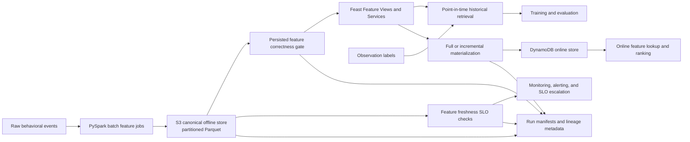

# FeatureForge Architecture

FeatureForge is a production-inspired feature platform for reproducible offline
training data and low-latency online ML feature serving.

The architecture prioritizes:

- reproducibility;
- event-time correctness;
- point-in-time feature semantics;
- canonical data ownership;
- executable data contracts;
- explicit correctness and freshness gates;
- visible failure behavior;
- offline/online serving parity;
- deterministic operational workflows.

## Architecture Overview

FeatureForge separates the platform into seven major concerns:

1. Source-data generation and validation.
2. Point-in-time feature computation.
3. Canonical offline feature storage.
4. Historical retrieval and model training.
5. Online materialization and serving.
6. Operational validation, CI, and failure handling.
7. A documented AWS production operating profile.

```text
validated YAML configuration
        ↓
deterministic synthetic source data
        ↓
source-data quality validation
        ↓
source Parquet datasets
        ↓
Pandas reference / PySpark parity layer
        ↓
point-in-time feature computation
        ↓
idempotent date-partitioned backfill
        ↓
canonical offline feature store
        ↓
correctness gate
        ↓
freshness SLO check
        ├── Feast historical retrieval → time-based training → model artifacts
        └── Feast materialization → Redis → online lookup → ranking
                                      ↓
                              offline/online parity
```

## Repository Boundaries

```text
featureforge/
├── configs/              Synthetic-data configuration
├── data/                 Generated and training artifacts
├── docs/
│   ├── adr/              Architecture decisions
│   ├── runbooks/         Operational recovery procedures
│   └── aws-production-profile.md
├── feature_repo/         Feast entities, sources, views, services, demos
├── scripts/              Training and diagnostic workflows
├── src/featureforge/     Application and platform implementation
├── tests/
│   ├── failure_simulations/
│   ├── integration/
│   └── unit/
├── ARCHITECTURE.md
├── CONTRIBUTING.md
├── Makefile
├── README.md
├── docker-compose.yml
└── pyproject.toml
```

The implementation is intentionally layered. Generation, storage, feature
computation, validation, materialization, and serving are separate concerns so
that each can be tested independently and composed into end-to-end workflows.

## Source Data

Synthetic data is generated from a validated YAML configuration. The generator
supports independent and behavioral modes.

The source datasets are written as typed Parquet files:

```text
output/source_data/
├── users.parquet
├── content.parquet
├── events.parquet
├── labels.parquet
└── run_manifest.json
```

The source layer models two clocks:

| Field | Meaning |
|---|---|
| `event_time` | When the user action actually occurred |
| `ingested_at` | When the platform received or processed the event |

Normal events satisfy:

```text
event_time == ingested_at
is_late == false
```

Late events satisfy:

```text
ingested_at > event_time
is_late == true
```

Source-data validation checks:

- referential integrity;
- temporal validity;
- event semantics;
- late-event semantics;
- observation-label validity;
- expected event and label volumes.

Generation writes a machine-readable manifest containing the configuration,
row counts, quality report, and output paths.

## Feature Computation

FeatureForge has Pandas and PySpark implementations of the same feature logic.
Pandas is the readable correctness reference. PySpark is the parity-tested
execution engine for future scale.

The current feature views are:

### User Engagement Features

Computed once per `user_id`:

- event count;
- unique content count;
- total watch seconds;
- search, play, and watch counts;
- days since last activity.

### Content Popularity Features

Computed once per `content_id`:

- view count;
- unique viewer count;
- total watch seconds;
- average watch seconds;
- search, play, and watch counts;
- days since last view.

Both views use the same point-in-time feature window:

```text
(observation_time - window_days, observation_time]
```

Therefore:

- events at the lower boundary are excluded;
- events at the observation timestamp are included;
- events after the observation timestamp are excluded.

Daily backfills use UTC midnight as the observation timestamp:

```text
observation_date=2026-03-12
observation_time=2026-03-12T00:00:00+00:00
```

The boundary semantics are tested in both Pandas and PySpark.

### Spark Time Handling

Spark timestamp behavior can vary across host and JVM timezone settings. The
Spark implementation avoids implicit timezone conversion by encoding timestamps
as UTC epoch microseconds before Spark processing and converting them back only
after collection.

A change to feature logic is incomplete until the Pandas and PySpark parity
suite passes.

## Canonical Offline Store

FeatureForge uses one canonical local offline feature-store root:

```text
output/offline_store/
```

The Hive-partitioned layout is:

```text
output/offline_store/
├── user_engagement_features/
│   └── observation_date=YYYY-MM-DD/
│       └── features.parquet
├── content_popularity_features/
│   └── observation_date=YYYY-MM-DD/
│       └── features.parquet
└── manifests/
    └── backfill-YYYY-MM-DD-to-YYYY-MM-DD.json
```

This path is a local V1 platform contract shared by:

| Component | Responsibility |
|---|---|
| Backfill | Writes deterministic date-partitioned feature data |
| Correctness gate | Validates persisted feature partitions before Feast writes |
| Freshness check | Evaluates the newest business-time partition per view |
| Feast `FileSource` | Reads canonical partitions for retrieval and materialization |
| Materialization | Validates the canonical source before invoking Feast |
| Serving parity | Compares Redis values with the latest canonical offline partition |
| Makefile workflows | Orchestrates the local lifecycle |

The central invariant is:

```text
Backfill output
    = correctness-gate input
    = freshness-check input
    = Feast source
    = materialization source
    = serving parity-test source
```

The application-level materialization API always validates this canonical path.
The generic correctness and freshness libraries remain path-configurable for
isolated tests and reusable validation workflows.

This prevents a split-brain failure mode where one path is validated while
Feast reads or materializes another path.

The decision is documented in:

- [ADR-001: Offline/Online Feature Store Split](docs/adr/ADR-001-offline-online-feature-store-split.md)
- [ADR-002: Canonical Offline Store Contract](docs/adr/ADR-002-canonical-offline-store-contract.md)

## Backfills and Idempotency

Backfills create both feature views for an inclusive date range. Output paths
are deterministic:

```text
<offline-store-root>/<feature-view>/observation_date=YYYY-MM-DD/features.parquet
```

Running the same backfill with the same source data, date range, window, and
code overwrites the same partition paths. It does not append random part files
or create duplicate logical snapshots.

Each backfill writes a manifest containing:

- run type;
- status;
- start and completion timestamps;
- date range;
- lookback window;
- execution engine;
- output directory;
- per-partition row counts;
- concrete feature paths.

Idempotency is a platform property, not merely an implementation detail. It
allows retries, reproducible demonstrations, and deterministic downstream reads.

## Correctness and Freshness

Correctness and freshness are separate platform concerns.

Correctness asks:

```text
Are persisted feature values structurally and semantically valid?
```

Freshness asks:

```text
Is the newest persisted feature snapshot current enough for the intended
serving workflow?
```

### Persisted-Feature Correctness Gate

Before every Feast materialization, FeatureForge validates the persisted
canonical offline feature partitions.

If validation fails:

- Feast is not invoked;
- a blocked materialization manifest is written;
- the failure is surfaced as an exception;
- the CLI returns a non-zero status.

This prevents known-invalid feature data from being promoted into Redis.

### Freshness SLO

Freshness is based on the newest Hive-style observation partition:

```text
observation_date=YYYY-MM-DD
```

It uses business observation time rather than filesystem modification time.
The V1 contract is:

```text
latest canonical observation partition
        must be within
configured maximum lag
        of
explicit UTC reference time
```

The local default maximum lag is 24 hours. Freshness checks evaluate every
required feature view independently and expose stable failed-check names such
as:

```text
user_engagement_features.freshness
content_popularity_features.freshness
```

Freshness is a serving-safety check. It must not be converted into an implicit
`datetime.now(UTC)` restriction on every historical materialization request.
A historical re-materialization may be correct even when the newest partition
is not fresh enough for present-time serving.

The decision is documented in
[ADR-003: Feature Freshness SLOs and Fail-Safe Serving](docs/adr/ADR-003-freshness-slos-and-fail-safe-serving.md).

## Feast Integration

Feast provides:

- entities;
- batch sources;
- feature views;
- feature services;
- historical retrieval;
- full materialization;
- incremental materialization;
- online feature lookup.

The Feast repository is located under:

```text
feature_repo/
├── entities.py
├── sources.py
├── feature_views.py
├── feature_services.py
├── historical_retrieval_demo.py
├── online_lookup_demo.py
└── personalization_demo.py
```

The local `FileSource` definitions read from:

```text
../output/offline_store/user_engagement_features
../output/offline_store/content_popularity_features
```

The materialization API intentionally does not accept an arbitrary offline-store
path. The CLI commands also do not expose an `--offline-store-dir` option. This
is a guardrail: validation and Feast must operate on the same canonical source.

### Full Materialization

Full materialization requires explicit timezone-aware UTC boundaries:

```text
start_time
end_time
```

The workflow validates the canonical offline store before invoking Feast and
writes a completed or blocked manifest.

### Incremental Materialization

Incremental materialization uses Feast's stored watermark to determine its
lower boundary. The caller supplies an explicit timezone-aware end time.

Both full and incremental materialization paths have controlled failure tests
for missing Feast repositories.

### Materialization Manifests

Completed and blocked attempts write JSON manifests under:

```text
output/materialization_manifests/
```

They record:

- run type and mode;
- status;
- timestamps;
- Feast repository path;
- canonical offline-store path;
- requested time range;
- correctness-report payload;
- failed check names for blocked runs.

## Historical Retrieval and ML Training

The training pipeline uses Feast historical retrieval with point-in-time joins.
Each training row receives only feature values available at its observation time.

The pipeline performs:

1. historical retrieval;
2. chronological train/validation/test splitting;
3. preprocessing with `StandardScaler`;
4. baseline classification with `LogisticRegression`;
5. persisted model and metric output;
6. diagnostic drift and calibration analysis.

Persisting preprocessing and model state together reduces training-serving skew.

Artifacts are written to:

```text
data/historical_features.parquet
output/models/baseline_logreg_pipeline.joblib
output/models/baseline_logreg_metrics.json
```

## Online Serving and Ranking

Redis is the local online store, provisioned through Docker Compose.
Feast materializes feature values into Redis, and serving code retrieves them
through feature services.

The serving layer provides typed lookup results for:

- user engagement features;
- content popularity features;
- ranked content candidates.

Unknown entities return no feature record rather than fabricated defaults.
Entity IDs must be non-empty.

The deterministic ranking score is intentionally transparent:

```text
ranking_score
    = 0.45 * user_engagement_score
    + 0.55 * content_popularity_score
```

Candidates are sorted by:

1. descending overall score;
2. ascending `content_id` as a stable tie-breaker.

This is a platform-consumer demonstration, not a production recommendation
model.

## Offline/Online Serving Parity

The integration suite compares online values from Redis-backed Feast with the
latest corresponding canonical offline partition.

It covers:

- user engagement features;
- content popularity features;
- unknown entities;
- batch lookup with unknown candidates;
- deterministic ranking over materialized values.

The parity contract is:

```text
latest canonical offline partition
        =
Redis-backed Feast online feature value
```

This validates that the materialization path did not silently alter the values
that the offline pipeline produced.

## Testing Strategy

FeatureForge treats tests as enforceable platform contracts.

Unit tests cover:

- configuration and model validation;
- deterministic data generation;
- event and label semantics;
- feature calculations;
- point-in-time boundaries;
- manifests and idempotency;
- persisted-feature correctness;
- freshness behavior;
- materialization timestamp contracts;
- online lookup and ranking behavior;
- Pandas/PySpark parity.

Integration tests cover:

- CLI execution;
- source Parquet round trips;
- CLI-to-backfill-to-Parquet workflows;
- historical retrieval;
- training workflows;
- materialization and online serving;
- offline/online parity.

Failure simulations cover:

| Scenario | Expected behavior |
|---|---|
| Stale partitions | Freshness fails with named checks and non-zero status |
| Fresh partitions | Freshness passes |
| Invalid backfill window | Clear validation error |
| Reversed date range | Clear validation error |
| Empty event stream | Valid zero-count features are produced |
| Missing Feast repository, full run | Materialization fails clearly |
| Missing Feast repository, incremental run | Materialization fails clearly |

Failure simulations are located under:

```text
tests/failure_simulations/
```

Operational runbooks are located under:

```text
docs/runbooks/
├── stale-features.md
├── failed-backfill.md
└── failed-materialization.md
```

## Continuous Integration

GitHub Actions provides the baseline quality gate for every push to `main` and
every pull request.

The workflow runs in a clean Ubuntu environment with Python 3.13 and validates:

- editable installation from the `src/` layout;
- package importability;
- Ruff formatting;
- Ruff linting;
- the pytest suite.

```text
push / pull request
        ↓
fresh Ubuntu runner
        ↓
editable package installation
        ↓
FeatureForge import verification
        ↓
Ruff format and lint checks
        ↓
pytest validation suite
```

The baseline CI workflow intentionally does not provision Redis, Docker
Compose, Feast, or materialized online features. The five online-serving tests
therefore skip when their infrastructure prerequisites are absent.

This separates two validation layers:

| Layer | Environment | Scope |
|---|---|---|
| Baseline CI | Clean GitHub Actions Ubuntu runner | Packaging, importability, formatting, linting, unit tests, failure simulations, Spark parity, CLI, and quality contracts |
| Serving integration | Docker Compose, Redis, Feast, canonical snapshots | Materialization, online lookup, ranking, and offline/online parity |

The decision is documented in
[ADR-004: GitHub Actions CI for Reproducible Validation](docs/adr/ADR-004-github-actions-ci.md).

## AWS Production Profile

FeatureForge documents a credible AWS production architecture profile without
deploying real infrastructure ahead of local correctness and reliability work.

The profile generalizes the local canonical-source contract to an
environment-owned S3 prefix:

```text
s3://featureforge-<environment>/offline-store/
```



Key production-profile decisions:

- One S3 bucket per environment: `dev`, `staging`, and `prod`. Buckets are
  never shared across environments.
- Hive-style Parquet partitions remain based on
  `observation_date=YYYY-MM-DD`, preserving the local partitioning contract.
- SSE-KMS encryption uses a customer-managed KMS key per environment.
- S3 bucket versioning protects against accidental overwrites and deletion.
- Lifecycle transitions use Infrequent Access and Glacier Instant Retrieval
  according to data access patterns, rather than blanket deletion.
- Three least-privilege IAM roles isolate backfill writes, materialization
  writes, and serving reads:
  - `featureforge-backfill-writer`;
  - `featureforge-materialization-writer`;
  - `featureforge-serving-reader`.
- DynamoDB is the documented AWS online-store profile. Redis remains the
  local Docker Compose online store.

The canonical-source invariant is unchanged in AWS:

```text
Backfill writer
    = Correctness-gate input
    = Freshness-check input
    = Feast FileSource
    = Materialization source
    = Serving parity-test source
```

Only the resolved URI changes from:

```text
output/offline_store/
```

to:

```text
s3://featureforge-<environment>/offline-store/
```

No AWS resources are provisioned by this documentation. It exists so the
production operating model can be evaluated and defended before any real
deployment occurs.

Full detail is documented in
[`docs/aws-production-profile.md`](docs/aws-production-profile.md) and
[ADR-005: AWS S3 Offline-Store Production Profile](docs/adr/ADR-005-aws-s3-offline-store-profile.md).

## Makefile Workflows

The Makefile exposes common workflows:

```bash
make setup
make docker-up
make docker-down
make lint
make test
make validate
make check-freshness
make e2e
make e2e-no-skip
make e2e-clean
make materialize-incremental
make demo
```

Useful overrides include:

```bash
make demo USER_ID=user_000290 TOP_K=5
make demo OUTPUT_DIR=output_demo
```

The local E2E workflow must preserve the canonical offline-store contract.
Run-scoped output directories may contain artifacts, but they must not cause
Feast to read a different offline source than the one validated by the platform.

## Reliability Principles

FeatureForge follows these principles:

- Prefer idempotent jobs.
- Use explicit time boundaries.
- Require timezone-aware materialization timestamps.
- Use event time for feature and label semantics.
- Make data contracts executable.
- Keep output paths deterministic.
- Maintain one canonical offline source for the local Feast workflow.
- Validate persisted offline correctness before online materialization.
- Check freshness from business-time partitions rather than filesystem metadata.
- Separate correctness from freshness.
- Fail before known-invalid or stale serving data reaches consumers.
- Record completed and blocked run metadata.
- Keep Pandas and Spark behavior parity-tested.
- Verify offline/online serving parity.
- Keep local development reproducible.
- Separate generation, storage, computation, materialization, and serving.
- Use stable ranking tie-breakers.
- Never trust implicit timezone handling across Python/JVM boundaries.
- Persist preprocessing with models to reduce training-serving skew.
- Treat failure simulations and runbooks as version-controlled artifacts.
- Keep environment boundaries, encryption, and IAM permissions explicit in the
  AWS production profile.

## Current Limitations

The project intentionally remains a focused local platform implementation:

- Redis is a local development online store.
- DynamoDB is the documented AWS production alternative, not yet deployed.
- Offline storage is local Parquet; S3 is a documented production profile, not
  yet deployed.
- `output/offline_store/` is a fixed local V1 contract.
- AWS environment-owned S3 URIs, KMS keys, IAM roles, and DynamoDB tables are
  documented but not provisioned.
- Freshness currently uses latest observation-date partitions and a configurable
  local maximum lag.
- Production freshness requires per-view ownership, scheduling, alerting, and
  escalation policy.
- The materialization gate protects the local application workflow; external
  incident remediation remains future work.
- Failure simulations do not yet cover Redis outages, Feast API failures,
  object-store failures, network faults, or production-scale chaos.
- The ranking function is a transparent deterministic demonstration, not a
  learned production ranking model.
- Kafka, Flink, Kubernetes, Terraform-heavy infrastructure, and production-scale
  distributed serving are outside V1.

## Future Architecture

The documented AWS production profile replaces the local fixed path with one
environment-owned storage URI:

```text
s3://featureforge-<environment>/offline-store/
```

The same resolved URI must be consumed by:

- the backfill writer;
- the persisted-feature correctness gate;
- freshness checks;
- Feast `FileSource` definitions;
- materialization manifests;
- lineage metadata;
- offline/online parity checks.

The next reliability and platform milestones are:

1. Add an infrastructure-enabled CI integration job with Redis, Feast, canonical
   snapshots, materialization, and online-serving validation.
2. Add scheduled freshness checks, feature-view ownership, alerting, and SLO
   escalation.
3. Extend materialization manifests with richer lineage and run metadata.
4. Add controlled simulations for Redis, Feast API, and object-storage failures.
5. Convert the documented AWS production profile into infrastructure as code.
6. Provision an AWS development environment after the infrastructure design is
   reviewed and cost boundaries are explicit.
7. Add MLflow experiment tracking and a model registry.
8. Add advanced models such as XGBoost or LightGBM where model complexity is
   justified by the platform use case.

## Architecture Decisions

Important durable decisions are documented as ADRs:

- [ADR-001: Offline/Online Feature Store Split](docs/adr/ADR-001-offline-online-feature-store-split.md)
- [ADR-002: Canonical Offline Store Contract](docs/adr/ADR-002-canonical-offline-store-contract.md)
- [ADR-003: Feature Freshness SLOs and Fail-Safe Serving](docs/adr/ADR-003-freshness-slos-and-fail-safe-serving.md)
- [ADR-004: GitHub Actions CI for Reproducible Validation](docs/adr/ADR-004-github-actions-ci.md)
- [ADR-005: AWS S3 Offline-Store Production Profile](docs/adr/ADR-005-aws-s3-offline-store-profile.md)