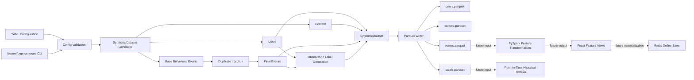
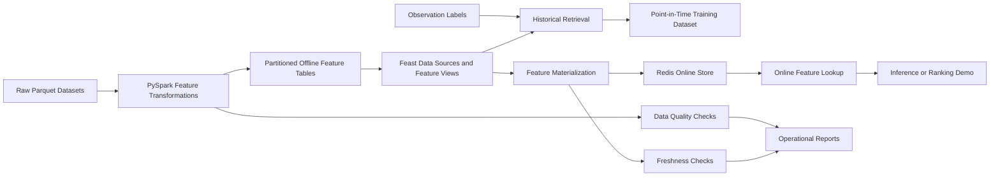

# FeatureForge Architecture

## Purpose

FeatureForge currently provides a deterministic synthetic-data and offline
dataset foundation for a future shared feature platform supporting offline model
training and low-latency online inference.

The implemented foundation is designed to make data contracts, time boundaries,
synthetic-data quality issues, and dataset generation reproducible from the
start.

The longer-term architecture will build on this foundation to prevent
training-serving skew, future-data leakage, stale online features, and
unreproducible backfills.

## Current Architecture



## Components

### Configuration

`SyntheticDataConfig` loads and validates YAML configuration before data
generation begins.

The configuration controls:

- random seed
- synthetic-data time range
- number of users, content items, base events, and observations
- duplicate event rate
- late-event rate
- maximum late-arrival duration
- label horizon

Configuration validation fails early when inputs are invalid.

Examples of enforced rules:

- `end_time` must be after `start_time`
- event rates must be between `0.0` and `1.0`
- entity and event counts must be positive
- `max_late_arrival_hours` must be greater than zero when
  `late_event_rate` is positive

### Synthetic Data Generation

The synthetic-data module generates deterministic, production-inspired
behavioral data.

Every generation stage uses a separate random-number-generator seed derived
from the configured base seed. This makes a complete run reproducible while
keeping individual stages independent.

The current generator produces:

- users
- content catalog entries
- base behavioral events
- duplicate event deliveries
- late-arriving events
- observation labels

For the same configuration and seed, FeatureForge produces the same entities,
events, labels, and Parquet output structure.

### Users and Content

Users and content items are generated as independent reference datasets.

User records include:

- `user_id`
- `signup_at`
- `country`
- `plan_tier`
- `acquisition_channel`

Content records include:

- `content_id`
- `title`
- `genre`
- `released_at`
- `duration_seconds`

Event and label records reference generated user IDs. Non-search events also
reference generated content IDs.

### Behavioral Events

Base events represent normal deliveries of behavioral activity.

Supported event types are:

- `impression`
- `click`
- `play`
- `watch`
- `like`
- `search`

A search event has no content reference:

```text
event_type=search
content_id=None
```

Watch-duration semantics are explicit:

```text
event_type in {play, watch}  -> watch_seconds > 0
all other event types        -> watch_seconds == 0
```

### Duplicate Injection

Duplicate injection models repeated delivery of the same behavioral event.

A duplicate event:

- receives a unique delivery ID with a `_duplicate_XX` suffix
- has `is_duplicate=True`
- preserves the original behavioral payload
- does not replace or mutate the original event
- is appended as an additional event delivery

Example:

```text
original:
event_id=event_00000042
is_duplicate=false

duplicate:
event_id=event_00000042_duplicate_01
is_duplicate=true
```

This allows downstream feature transformations and data-quality checks to test
deduplication behavior explicitly.

### Late-Event Injection

Late-event injection models events that occur at one time but arrive at the
platform later.

A late event:

- preserves its original `event_time`
- receives a later `ingested_at`
- has `is_late=True`
- keeps all behavioral payload fields unchanged
- has a delay bounded by `max_late_arrival_hours`

Late-event injection does not add events or remove events. It returns a new
event collection and leaves the input collection unchanged.

### Observation Labels

Observation labels convert behavioral events into an ML-oriented target.

Each label answers:

> Did this user have at least one behavioral event during the configured future
> label window?

A label contains:

- `label_id`
- `user_id`
- `observation_time`
- `label_window_end`
- `is_active_next_7d`

The configured label horizon determines the window end:

```text
label_window_end = observation_time + label_horizon_days
```

The target is calculated with event time:

```text
observation_time < event_time <= label_window_end
```

This is intentional: labels represent future user behavior, not the time at
which the platform received an event.

### Dataset Orchestration

`generate_synthetic_dataset()` is the single in-memory entry point for the
current data-generation pipeline.

It executes the stages in this order:

```text
generate users
        ↓
generate content
        ↓
generate base events
        ↓
inject duplicates
        ↓
inject late events
        ↓
generate observation labels
        ↓
return SyntheticDataset
```

`SyntheticDataset` is a typed container holding:

- users
- content items
- events
- labels

Generation, data persistence, and command-line execution remain separated.

### Parquet Persistence

The storage layer writes the `SyntheticDataset` to four Parquet tables:

```text
data/generated/
├── users.parquet
├── content.parquet
├── events.parquet
└── labels.parquet
```

Parquet is the current offline-storage format because it is columnar, supports
typed data, and can be consumed by Pandas, PyArrow, PySpark, and later offline
feature-store workflows.

Generated artifacts are ignored by Git. They are reproducible from the YAML
configuration and should not be committed.

### Command-Line Interface

The CLI provides the current end-to-end execution path:

```bash
featureforge generate \
  --config configs/synthetic_data.yaml \
  --output data/generated
```

The CLI performs:

```text
load YAML configuration
        ↓
validate configuration
        ↓
generate SyntheticDataset
        ↓
write Parquet tables
        ↓
print dataset summary
```

The terminal summary reports:

- row count for each Parquet table
- total event deliveries
- duplicate event count
- late event count
- output paths

## Temporal Correctness

### Event Time and Ingestion Time

FeatureForge explicitly models two clocks:

| Field | Meaning |
|---|---|
| `event_time` | When the user action actually occurred |
| `ingested_at` | When the platform received or processed the event |

For normal base events:

```text
event_time == ingested_at
is_late == false
```

For late events:

```text
ingested_at > event_time
is_late == true
```

The event contract rejects invalid time relationships:

```text
ingested_at < event_time
```

It also rejects a late-event flag without a real ingestion delay:

```text
is_late == true
ingested_at <= event_time
```

### Label-Time Correctness

Labels use `event_time`, not `ingested_at`:

```text
observation_time < event_time <= label_window_end
```

This keeps labels aligned with actual user behavior and provides a clean basis
for later point-in-time-correct historical feature retrieval.

When feature transformations are added, no event occurring after an
observation timestamp may influence a feature value at that timestamp.

## Data Contracts

Pydantic models provide executable contracts for all generated records:

- `User`
- `Content`
- `Event`
- `ObservationLabel`
- `SyntheticDataset`
- `SyntheticDataConfig`

The contracts validate structural and semantic rules before invalid records
reach Parquet output or later feature-serving components.

Examples include:

- required non-empty identifiers
- valid content duration
- non-negative watch duration
- valid observation windows
- valid event-time and ingestion-time ordering
- configuration-rate bounds
- valid generation time range

## Testing Strategy

FeatureForge treats tests as part of the feature contract.

The current suite covers:

- configuration loading and validation
- cross-field validation for late-event settings
- event and label model validation
- deterministic user generation
- deterministic content generation
- deterministic base-event generation
- referential integrity for generated events
- base-event time and watch-duration semantics
- deterministic duplicate injection
- duplicate payload preservation
- duplicate-input immutability
- deterministic late-event injection
- valid late-event delays
- late-event payload preservation
- late-event-input immutability
- deterministic observation-label generation
- label-window correctness
- label values derived from matching events
- full dataset orchestration
- Parquet file creation and read-back validation
- Parquet timestamp and quality-flag preservation
- CLI argument parsing
- CLI integration from configuration to Parquet output

Run the full suite with:

```bash
pytest -v
```

Run format and lint checks with:

```bash
ruff format --check src tests
ruff check src tests
```

## Future Architecture

The current Parquet datasets are the input foundation for the remaining
FeatureForge stages.



### PySpark Transformations

Future PySpark jobs will transform raw behavioral data into feature tables.

The transformations must be:

- event-time aware
- deterministic
- idempotent
- testable
- parameterized by explicit time ranges
- safe for historical backfills

### Offline Feature Store

The planned offline storage profile uses partitioned Parquet data.

```text
s3://featureforge/
  raw/
  offline/
    feature_view=user_engagement/
      event_date=YYYY-MM-DD/
  observations/
  manifests/
```

The offline store will support:

- historical feature retrieval
- training-dataset generation
- reproducible backfills
- audits
- feature provenance

### Feast

Feast will provide:

- entities
- data sources
- feature views
- feature services
- historical retrieval
- online materialization
- online feature lookup

Feature definitions will remain version-controlled Python code.

### Online Feature Store

Redis is the planned local online store because it supports low-latency
key-value access and runs reproducibly through Docker Compose.

DynamoDB is the documented AWS production alternative.

### Materialization

Materialization will move current feature values from the offline feature store
into the online store.

The materialization process must support:

- full materialization
- incremental materialization
- retry-safe execution
- freshness reporting
- structured run manifests

### Data Quality

Before materialization, FeatureForge will validate:

- required schema
- non-null entity keys
- duplicate entity and timestamp pairs
- valid feature ranges
- referential integrity
- input volume anomalies
- feature freshness

Failed quality checks must block materialization.

## Reliability Principles

- Prefer idempotent jobs.
- Make time boundaries explicit.
- Make data contracts executable.
- Fail before invalid data reaches serving.
- Keep transformations deterministic.
- Preserve input immutability where practical.
- Record run metadata.
- Keep local development reproducible.
- Separate generation, storage, and interface concerns.
- Document production trade-offs.

## V1 Non-Goals

The first version intentionally does not include:

- Kafka or Flink
- Kubernetes
- Terraform-heavy infrastructure
- a complex ML model
- multiple microservices
- production-scale distributed serving

These topics belong to later roadmap projects or future FeatureForge
extensions.