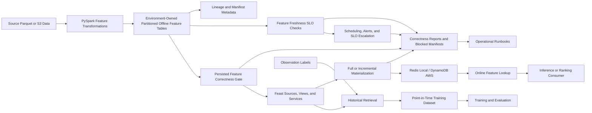

# FeatureForge Architecture

## Purpose

FeatureForge is a production-inspired feature platform for reproducible offline
training data and low-latency online ML feature serving.

The project demonstrates end-to-end Data Infrastructure, Feature
Infrastructure, and ML Platform Engineering fundamentals:

- Executable data contracts
- Deterministic synthetic data generation in independent and behavioral modes
- Event-time-aware feature computation
- Point-in-time correctness
- Partitioned offline feature datasets
- Reproducible, date-parameterized backfills
- Auditable generation, backfill, and materialization manifests
- Source-data and persisted-feature correctness validation
- Pre-materialization correctness gates
- Feature freshness SLO checks
- Canonical offline-store ownership
- Controlled failure simulations and operational runbooks
- Offline/online feature parity checks
- Engine-independent feature correctness through Pandas/PySpark parity
- Feast historical retrieval and online serving
- Full and incremental online materialization into Redis
- Online feature retrieval and deterministic candidate ranking
- ML-ready training pipelines with time-based evaluation
- A reproducible one-command local demonstration

FeatureForge is intentionally local-first. Its goal is not to imitate every
production component, but to prove the contracts, reliability properties, and
operational boundaries that make a feature platform trustworthy.

## Architecture Decisions

The project records key decisions as Architecture Decision Records:

- [ADR-001: Offline/Online Feature Store Split](docs/adr/ADR-001-offline-online-feature-store-split.md)
- [ADR-002: Canonical Offline Store Contract](docs/adr/ADR-002-canonical-offline-store-contract.md)
- [ADR-003: Feature Freshness SLOs and Fail-Safe Serving](docs/adr/ADR-003-freshness-slos-and-fail-safe-serving.md)

The local V1 architecture separates two distinct responsibilities:

```text
Offline feature storage
    partitioned Parquet data for backfill, training, validation,
    historical retrieval, and materialization
        ↓
Feast
    feature definitions, historical retrieval, and materialization boundary
        ↓
Online feature storage
    Redis for low-latency feature serving
```

The canonical local offline-store root is:

```text
output/offline_store/
```

The central V1 invariant is:

```text
Backfill output
    =
Correctness-gate input
    =
Freshness-check input
    =
Feast FileSource input
    =
Materialization source
    =
Serving parity-test source
```

This prevents split-brain behavior in which one dataset is validated while
Feast reads or materializes another dataset.

## Platform Guarantees

FeatureForge currently provides the following verified properties:

| Concern | Current guarantee |
|---|---|
| Reproducibility | Fixed seeds, deterministic output layouts, explicit dates and windows |
| Point-in-time correctness | Features use \( (observation\_time - window, observation\_time] \) |
| Timezone safety | UTC contracts at the Python boundary; Spark uses UTC epoch microseconds |
| Backfill idempotency | Repeated identical runs overwrite deterministic feature partitions |
| Engine correctness | Pandas reference output is parity-tested against PySpark |
| Canonical offline source | Backfill, correctness validation, freshness checks, Feast FileSources, materialization, and serving parity checks use `output/offline_store/` |
| Pre-materialization correctness | Invalid canonical offline partitions block Feast materialization before Redis writes |
| Feature freshness | The newest canonical partition for each required feature view is checked against an explicit UTC reference time and maximum lag |
| Serving-safety automation | `featureforge check-freshness` and `make check-freshness` return non-zero status when canonical features exceed the configured freshness SLO |
| Historical reproducibility | Correct historical materialization ranges are not rejected only because they are old relative to current wall-clock time |
| Online serving | Feast materializes user and content feature views into Redis |
| Consumer behavior | Online lookup and ranking use only materialized Feast feature values |
| Offline/online parity | Integration tests compare Redis values with the latest canonical offline partitions |
| Operational evidence | JSON manifests record generation, backfill, and completed or blocked materialization runs |
| Failure handling | Controlled tests verify stale features, invalid backfill input, and failed materialization behavior |
| Operational recovery | Version-controlled runbooks document diagnosis, recovery, verification, and prevention |
| Developer experience | `docker compose up -d && make demo` runs the local vertical slice |
| Test coverage | Unit, integration, and failure-simulation tests validate contracts, temporal behavior, reliability gates, and serving |

## Current Architecture

```mermaid
flowchart LR
    Config[YAML Configuration] --> Validate[Config Validation]
    Validate --> Generate[Synthetic Dataset Generator]

    Generate --> Users[Users]
    Generate --> Content[Content]
    Generate --> BaseEvents[Base Behavioral Events]

    BaseEvents --> Duplicate[Duplicate Injection]
    Duplicate --> Late[Late-Event Injection]
    Late --> Events[Delivered Events]

    Users --> Labels[Observation Label Generation]
    Events --> Labels

    Users --> Dataset[SyntheticDataset]
    Content --> Dataset
    Events --> Dataset
    Labels --> Dataset

    Dataset --> SourceQuality[Source Quality Validation]
    SourceQuality --> SourceParquet[Source Parquet Writer]

    SourceParquet --> UsersParquet[users.parquet]
    SourceParquet --> ContentParquet[content.parquet]
    SourceParquet --> EventsParquet[events.parquet]
    SourceParquet --> LabelsParquet[labels.parquet]
    SourceParquet --> GenerationManifest[Generation Manifest]

    UsersParquet --> PandasBackfill[Pandas Backfill Engine]
    ContentParquet --> PandasBackfill
    EventsParquet --> PandasBackfill

    UsersParquet -. parity checked .-> SparkBackfill[PySpark Feature Engine]
    ContentParquet -. parity checked .-> SparkBackfill
    EventsParquet -. parity checked .-> SparkBackfill

    PandasBackfill --> UserFeatures[User Engagement Feature Partitions]
    PandasBackfill --> ContentFeatures[Content Popularity Feature Partitions]
    PandasBackfill --> BackfillManifest[Backfill Manifest]

    UserFeatures --> CanonicalStore[Canonical Offline Store<br/>output/offline_store]
    ContentFeatures --> CanonicalStore

    CanonicalStore --> OfflineCorrectness[Persisted Offline Feature<br/>Correctness Validation]
    CanonicalStore --> OfflineFreshness[Feature Freshness<br/>SLO Check]

    OfflineCorrectness --> FeastSources[Feast FileSources]
    FeastSources --> FeatureViews[Feast Feature Views]

    FeatureViews --> Historical[Historical Retrieval]
    LabelsParquet --> Historical
    Historical --> Training[Point-in-Time Training Dataset]
    Training --> Model[sklearn Pipeline Training]
    Model --> Artifacts[Model + Metrics]

    OfflineCorrectness --> Materialize[Full or Incremental<br/>Materialization]
    OfflineFreshness -. current serving safety .-> Materialize
    Materialize --> Redis[Redis Online Store]
    Materialize --> MaterializationManifest[Completed or Blocked<br/>Materialization Manifest]

    Redis --> Lookup[Online Feature Lookup]
    Lookup --> Ranking[Deterministic Candidate Ranking]
    Ranking --> Consumer[Personalization Consumer Demo]

    CanonicalStore --> Parity[Offline/Online<br/>Serving Parity Tests]
    Redis --> Parity

    OfflineFreshness --> FreshnessCLI[check-freshness CLI]
    FreshnessCLI --> Runbooks[Operational Runbooks]
    MaterializationManifest --> Runbooks
```



## Main Data Flows

FeatureForge exposes five executable local flows.

### 1. Synthetic Dataset Generation

```text
YAML configuration
        ↓
configuration validation
        ↓
deterministic synthetic dataset generation
        ↓
duplicate and late-event injection
        ↓
observation-label generation
        ↓
source-data quality validation
        ↓
source Parquet datasets
        ↓
generation run manifest
```

Run generation directly:

```bash
featureforge generate \
  --config configs/synthetic_data.yaml \
  --output output/source_data
```

Output:

```text
output/source_data/
├── users.parquet
├── content.parquet
├── events.parquet
├── labels.parquet
└── run_manifest.json
```

### 2. Offline Feature Backfill

```text
source Parquet datasets
        ↓
inclusive date-range iteration
        ↓
UTC observation timestamp per date
        ↓
point-in-time user feature aggregation
        ↓
point-in-time content feature aggregation
        ↓
canonical partitioned feature Parquet datasets
        ↓
backfill run manifest
```

Run a canonical local backfill:

```bash
featureforge backfill \
  --input output/source_data \
  --output output/offline_store \
  --start-date 2026-03-10 \
  --end-date 2026-03-12 \
  --window-days 7 \
  --engine pandas
```

The Spark engine is also available:

```bash
featureforge backfill \
  --input output/source_data \
  --output output/offline_store \
  --start-date 2026-03-10 \
  --end-date 2026-03-12 \
  --window-days 7 \
  --engine spark
```

The generic backfill API can write to isolated paths for testing or local
experiments. The local Feast materialization workflow, however, uses only the
canonical `output/offline_store/` contract.

### 3. Offline Feature Freshness Check

Feature correctness and feature freshness are intentionally separate
reliability concerns.

Correctness asks:

```text
Are persisted feature values structurally and semantically valid?
```

Freshness asks:

```text
Is the newest persisted feature snapshot recent enough for the intended
serving workflow?
```

Freshness is derived from the latest Hive-partitioned observation date for each
required feature view:

```text
output/offline_store/
├── user_engagement_features/
│   └── observation_date=YYYY-MM-DD/
└── content_popularity_features/
    └── observation_date=YYYY-MM-DD/
```

The check does not use filesystem modification time as its primary signal.
File-write time describes storage activity, whereas `observation_date`
represents the business time through which the feature snapshot is valid.

The V1 freshness contract is:

```text
latest canonical observation partition
        must be within
configured maximum lag
        of
explicit UTC reference time
```

Run the default reproducible local check:

```bash
make check-freshness
```

Run the CLI with an explicit reference time:

```bash
featureforge check-freshness \
  --reference-time 2026-03-25T00:00:00+00:00 \
  --max-lag-hours 24
```

The default local maximum lag is 24 hours.

A stale or missing view produces a stable named failed check and a non-zero
process exit code:

```text
user_engagement_features.freshness
content_popularity_features.freshness
```

### 4. Feast Materialization and Online Serving

```text
canonical partitioned offline feature data
output/offline_store/
        ↓
persisted offline feature-correctness validation
        ↓
Feast FileSources and Feature Views
        ↓
full or incremental Feast materialization
        ↓
Redis online store
        ↓
online feature lookup
        ↓
deterministic ranking / personalization decision
        ↓
offline/online parity validation
```

The persisted-feature correctness gate is mandatory before every Feast write.

Freshness is an explicit serving-safety check for workflows that require
current feature snapshots. It is not a blanket `datetime.now(UTC)` restriction
on every historical materialization request.

A historical re-materialization can be legitimate when the persisted features
are correct for the requested historical interval, even if the newest canonical
partition is not current enough for present-time serving.

The resulting contract is:

```text
Correctness:
mandatory before every Feast materialization

Freshness:
explicit for current serving, demo, and operational workflows
```

Full materialization uses an explicit UTC interval:

```bash
featureforge materialize \
  --repo feature_repo \
  --start-time 2026-03-20T00:00:00+00:00 \
  --end-time 2026-03-25T00:00:00+00:00 \
  --manifest-output output
```

Incremental materialization uses Feast's stored materialization watermark:

```bash
featureforge materialize-incremental \
  --repo feature_repo \
  --end-time 2026-03-25T00:00:00+00:00 \
  --manifest-output output
```

The commands intentionally do not accept an `--offline-store-dir` parameter.
This enforces that FeatureForge validates the same canonical source configured
in the Feast FileSources.

### 5. One-Command Platform Demonstration

Start Redis:

```bash
docker compose up -d
```

Run the complete local workflow:

```bash
make demo
```

The command executes:

```text
generate
  → canonical backfill into output/offline_store
  → persisted offline feature-correctness validation
  → explicit freshness check for the serving workflow
  → Feast full materialization into Redis
  → user online-feature lookup
  → deterministic content-candidate ranking
  → offline/online serving parity checks
```

The demo defaults are configurable:

```bash
make demo USER_ID=user_000290 TOP_K=5
```

The E2E output directory is also configurable:

```bash
make demo OUTPUT_DIR=output_demo
```

`OUTPUT_DIR` is used for generated source data and run artifacts. The local
Feast source remains the canonical `output/offline_store/` location.

## Configuration

`SyntheticDataConfig` loads and validates YAML configuration before generation.

The configuration controls:

- Random seed
- Synthetic-data time range
- Number of users, content items, events, and observations
- Duplicate event rate
- Late-event rate
- Maximum late-arrival duration
- Label horizon
- Event generation mode: `independent` or `behavioral`

Examples of enforced rules:

- `end_time` must be after `start_time`.
- Rates must be between `0.0` and `1.0`.
- Entity and event counts must be positive.
- `max_late_arrival_hours` must be positive when late events are enabled.

## Synthetic Data

### Generation Model

Every generation stage uses a separate random-number-generator seed derived
from the configured base seed. This keeps individual stages independent while
making the overall run reproducible.

Generated datasets contain:

- Users
- Content catalog entries
- Base behavioral events
- Duplicate event deliveries
- Late-arriving event deliveries
- Observation labels

### Behavioral Mode

Behavioral mode adds persistent user-level activity propensity.

- Every user receives one fixed `activity_weight`.
- Event counts are drawn from a distribution influenced by that weight.
- Higher-weight users consistently produce more events.
- Engagement features therefore carry genuine predictive signal for future
  activity without leaking label information.

Typical baseline-model results in behavioral mode are approximately:

| Split | Rows | Positive rate | AUC | Precision@25 |
|---|---:|---:|---:|---:|
| Train | 625 | 57.4% | 0.7725 | 1.00 |
| Validation | 134 | 56.7% | 0.7688 | 0.88 |
| Test | 134 | 50.0% | 0.6973 | 0.84 |

These values are example outputs from the configured synthetic dataset rather
than a production-model performance claim.

### Event Semantics

Supported event types:

- `impression`
- `click`
- `play`
- `watch`
- `like`
- `search`

Search events have no content reference:

```text
event_type=search
content_id=None
```

Watch-duration rules are explicit:

```text
event_type in {play, watch}  → watch_seconds > 0
all other event types        → watch_seconds == 0
```

### Duplicate Events

A duplicate event represents repeated delivery of the same behavioral action.

```text
original:
event_id=event_00000042
is_duplicate=false

duplicate:
event_id=event_00000042_duplicate_01
is_duplicate=true
```

The duplicate retains the original payload but has a unique delivery ID. This
allows downstream data-quality and deduplication behavior to be tested.

### Late Events

Late events preserve their original `event_time` but arrive with a later
`ingested_at`.

```text
event_time   = when the user action occurred
ingested_at  = when FeatureForge received the event
```

A late event satisfies:

```text
ingested_at > event_time
is_late == true
```

## Feature Contracts

FeatureForge currently defines two feature views.

### User Engagement Features

Computed once per `user_id` and observation time:

- `event_count`
- `unique_content_count`
- `total_watch_seconds`
- `search_count`
- `play_count`
- `watch_count`
- `days_since_last_activity`

### Content Popularity Features

Computed once per `content_id` and observation time:

- `view_count`
- `unique_viewer_count`
- `total_watch_seconds`
- `average_watch_seconds`
- `search_count`
- `play_count`
- `watch_count`
- `days_since_last_view`

All feature batches validate that their records share one observation timestamp
and one lookback window.

## Temporal Correctness

FeatureForge uses event time for both label and feature semantics.

### Label Window

```text
observation_time < event_time <= label_window_end
```

Labels answer whether a user becomes active during a configured future window.

### Feature Window

```text
observation_time - window_days < event_time <= observation_time
```

Therefore:

- Events at the lower boundary are excluded.
- Events at the observation time are included.
- Events after the observation time are excluded.
- Future events cannot affect earlier feature values.

### Daily Backfill Time

For every observation date, FeatureForge uses UTC midnight:

```text
observation_date=2026-03-12
observation_time=2026-03-12T00:00:00+00:00
```

The resulting partition represents the feature state available at that instant.

## Pandas and PySpark Parity

Pandas is the readable reference implementation. PySpark is the scalable
execution path. They must produce identical feature contracts.

The parity suite covers:

- Empty datasets
- Exact time-window boundaries
- Multiple users and content IDs
- Typed event counts
- Floating-point averages
- Randomized multi-entity datasets
- Invalid `window_days` rejection

### Timezone-Safe Spark Representation

Spark timestamp round trips can depend on host and JVM timezone behavior.
FeatureForge therefore avoids sending Python `datetime` values into Spark
`TimestampType` for feature computation.

Instead, event timestamps are converted to UTC epoch microseconds:

```python
def _to_epoch_micros(value: datetime) -> int:
    if value.tzinfo is None:
        raise ValueError("event_time must be timezone-aware")
    return int(value.astimezone(UTC).timestamp() * 1_000_000)
```

Window filtering operates on integer epoch microseconds. UTC-aware Python
datetimes are reconstructed only after Spark collection.

This prevents host-local timezone shifts from silently changing recency
features such as `days_since_last_activity`.

## Offline Storage and Backfills

Source datasets are persisted as Parquet:

```text
<output>/
├── users.parquet
├── content.parquet
├── events.parquet
└── labels.parquet
```

The canonical local offline feature store is:

```text
output/offline_store/
├── user_engagement_features/
│   └── observation_date=YYYY-MM-DD/
│       └── features.parquet
├── content_popularity_features/
│   └── observation_date=YYYY-MM-DD/
│       └── features.parquet
└── manifests/
    └── backfill-YYYY-MM-DD-to-YYYY-MM-DD.json
```

Feature batches use deterministic partition paths:

```text
<offline-store-root>/<feature_view>/observation_date=YYYY-MM-DD/features.parquet
```

For local Feast workflows:

```text
<offline-store-root> = output/offline_store
```

### Idempotency

A repeated backfill with identical source data, code, date range, and window
writes to the same canonical partitions:

```text
output/offline_store/<feature_view>/
observation_date=YYYY-MM-DD/features.parquet
```

The job overwrites that deterministic path rather than appending random
artifacts. Idempotency is verified by tests that compare repeated Parquet
outputs.

### Canonical Store Ownership

The canonical path is not merely a documentation convention. It is the
explicit local V1 contract shared by:

| Component | Responsibility |
|---|---|
| Backfill | Writes date-partitioned Parquet features |
| Offline correctness gate | Validates persisted partitions before materialization |
| Offline freshness check | Validates latest business-time partitions for serving workflows |
| Feast FileSources | Reads feature data for historical retrieval and materialization |
| Materialization workflow | Validates the exact canonical Feast source |
| Serving parity tests | Compare online Redis values with canonical offline snapshots |
| Demo workflow | Orchestrates the shared local data lifecycle |

The generic validation library remains path-configurable for reusable checks
and isolated tests. The production-like local materialization boundary is not
path-configurable, because it must validate exactly what Feast reads.

## Offline Feature Correctness Gate

FeatureForge validates persisted offline feature partitions before invoking
Feast materialization.

```text
canonical offline store
output/offline_store/
        ↓
offline feature-correctness validation
        ↓
passed
        ↓
Feast materialization
        ↓
Redis online store
```

If validation fails:

```text
canonical offline store
        ↓
offline feature-correctness validation
        ↓
failed checks
        ↓
materialization blocked
        ↓
blocked materialization manifest
        ↓
no Feast write is invoked
        ↓
no known-invalid values are promoted to Redis
```

The correctness gate validates persisted feature-store data rather than only
in-memory computation results. This protects the serving path from problems
introduced by storage, serialization, type changes, incomplete partitions, or
unexpected feature values.

The materialization implementation uses:

```python
_CANONICAL_OFFLINE_STORE_DIR = Path("output/offline_store")
```

Both full and incremental materialization validate this source before creating a
Feast `FeatureStore` and invoking Feast.

## Offline Feature Freshness

Feature correctness and feature freshness are intentionally separate concerns.

Correctness asks:

```text
Are the persisted feature values structurally and semantically valid?
```

Freshness asks:

```text
Is the newest persisted feature snapshot recent enough for the intended
serving workflow?
```

Freshness is derived from the latest Hive-partitioned observation date for each
feature view:

```text
output/offline_store/
├── user_engagement_features/
│   └── observation_date=YYYY-MM-DD/
└── content_popularity_features/
    └── observation_date=YYYY-MM-DD/
```

The check does not use filesystem modification time because file-write time does
not represent the business timestamp at which the feature snapshot is valid.

The local V1 freshness contract is:

```text
latest_observation_partition
        must be within
configured_max_lag
        of
explicit_utc_reference_time
```

The local default SLO is 24 hours.

```bash
featureforge check-freshness \
  --reference-time 2026-03-25T00:00:00+00:00 \
  --max-lag-hours 24

make check-freshness
```

A stale feature view produces one stable failed check:

```text
user_engagement_features.freshness
content_popularity_features.freshness
```

The CLI exits non-zero on failure so the check can be used by Make targets,
scheduled operations, and future CI.

Freshness is an explicit serving-safety gate. It is deliberately not imposed
on every historical Feast materialization interval: a historical
re-materialization can be legitimate even when newer partitions exist. The
pre-materialization correctness gate remains mandatory for every Feast write.

## Feast Layer

### Entities

- `user` with join key `user_id`
- `content` with join key `content_id`

### Feature Views

- `user_engagement_features`
- `content_popularity_features`

### Feature Services

- `user_engagement_service`
- `content_popularity_service`

Feature services expose curated feature sets to online consumers instead of
requiring every client to repeat feature-view and field selection.

### File Sources

The Feast FileSources are rooted in the canonical local store:

```text
feature_repo/../output/offline_store/user_engagement_features
feature_repo/../output/offline_store/content_popularity_features
```

This is intentionally aligned with the application-level materialization
contract.

### Historical Retrieval

```text
labels.parquet
        ↓
Feast get_historical_features()
        ↓
point-in-time join
        ↓
training DataFrame
```

Historical retrieval joins labels to feature values available at each label
observation time. This protects training data from future-data leakage.

Run it with:

```bash
python feature_repo/historical_retrieval_demo.py
```

## Materialization

FeatureForge wraps Feast materialization behind explicit UTC and canonical-source
contracts.

### Full Materialization

`materialize(...)` requires:

- A timezone-aware `start_time`
- A timezone-aware `end_time`
- `start_time < end_time`
- A Feast repository path
- A manifest output directory

The workflow:

1. Normalizes timestamps to UTC.
2. Validates `output/offline_store/` for persisted-feature correctness.
3. Writes a blocked manifest and raises `MaterializationBlockedError` if
   correctness validation fails.
4. Creates the Feast `FeatureStore` only after correctness validation passes.
5. Calls Feast materialization for the explicit interval.
6. Writes a completed materialization manifest.

### Incremental Materialization

`materialize_incremental(...)` requires:

- A timezone-aware `end_time`
- A Feast repository path
- A manifest output directory

The workflow validates the canonical offline store for correctness before
invoking Feast. Feast determines the lower boundary from its materialization
watermark.

### Materialization Source Contract

The materialization functions intentionally do not accept an
`offline_store_dir` parameter.

Likewise, the CLI commands intentionally do not accept an
`--offline-store-dir` flag:

```bash
featureforge materialize
featureforge materialize-incremental
```

This is a deliberate guardrail. It prevents a caller from validating an
arbitrary path while Feast reads the canonical FileSource location.

### Materialization Manifests

Completed and blocked materialization attempts write JSON manifests under:

```text
<manifest-output>/materialization_manifests/
```

Full run naming:

```text
materialize-<start>-to-<end>.json
```

Incremental run naming:

```text
materialize-incremental-to-<end>.json
```

The manifests record:

- Run type
- Start timestamp
- Completion timestamp or blocked timestamp
- Status: `completed` or `blocked`
- Mode: `full` or `incremental`
- Feast repository path
- Canonical offline-store path
- Explicit start time for full runs
- End time
- Manifest-output directory
- Full offline correctness-report payload
- Failed correctness-check names for blocked runs

## Online Serving and Ranking

### Online Lookup

`src/featureforge/serving.py` retrieves current feature values through Feast
feature services.

It provides typed dataclasses:

- `UserEngagementOnlineFeatures`
- `ContentPopularityOnlineFeatures`
- `RankedContent`
- `RankingResult`

Lookup helpers validate non-empty entity IDs and return `None` when the
expected materialized record is absent.

### Transparent Scores

The user engagement score is a bounded weighted combination of:

- Event activity
- Distinct-content activity
- Watch time
- Search, play, and watch counts
- Recent activity

The content popularity score similarly uses:

- View volume
- Unique viewers
- Watch time
- Average watch duration
- Typed interaction counts
- Recency

Scores are normalized and rounded for deterministic behavior.

### Ranking

The ranking score combines user engagement and content popularity:

```text
ranking_score =
    0.45 × user_engagement_score +
    0.55 × content_popularity_score
```

Candidates are sorted by:

1. Descending overall score
2. Ascending `content_id` as a stable tie-breaker

This is deliberately simple and transparent. It demonstrates how a consumer
uses online feature values; it is not intended as a production recommendation
model.

Run the demos directly:

```bash
python feature_repo/online_lookup_demo.py --user-id user_000290

python feature_repo/personalization_demo.py \
  --user-id user_000290 \
  --top-k 5
```

### Offline/Online Serving Parity

The integration suite verifies that values returned from the Redis-backed Feast
online store match the latest corresponding canonical offline feature snapshot.

The checks cover:

- User engagement features
- Content popularity features
- Unknown entities
- Batch content lookup with unknown candidates
- Deterministic ranking over materialized online values

This gives the local platform an executable serving-consistency contract:

```text
latest canonical offline partition
        =
Redis-backed Feast online feature value
```

## ML Training

The baseline ML pipeline uses point-in-time historical features and
chronological evaluation.

```text
historical feature dataset
        ↓
time-based train / validation / test split
        ↓
sklearn Pipeline
        ↓
logistic regression baseline
        ↓
persisted model and metrics
```

The persisted pipeline includes preprocessing and model state together to
reduce training-serving skew.

Training artifacts:

```text
output/models/
├── baseline_logreg_pipeline.joblib
└── baseline_logreg_metrics.json
```

Run the baseline training flow:

```bash
python scripts/train_baseline.py
```

Run diagnostics:

```bash
python scripts/diagnose_baseline.py
```

## Run Manifests

FeatureForge writes machine-readable JSON manifests.

### Generation Manifest

Contains:

- Generation timestamp
- Full configuration
- Table row counts
- Quality report
- Output paths

### Backfill Manifest

Contains:

- Run type
- Start and completion timestamps
- Status
- Start date and end date
- Lookback window
- Execution engine
- Output directory
- One record for each observation-date partition
- User/content row counts
- Concrete feature output paths

### Materialization Manifest

Contains:

- Run type
- Start timestamp
- Completion or blocked timestamp
- Status
- Materialization mode
- Feast repository path
- Canonical offline-store path
- Time range or incremental end time
- Manifest-output directory
- Offline correctness-report payload
- Failed checks when materialization is blocked

## Command-Line Interface

FeatureForge commands:

```bash
# Generate source datasets.
featureforge generate \
  --config configs/synthetic_data.yaml \
  --output output/source_data

# Compute one user engagement snapshot.
featureforge compute-features \
  --input output/source_data \
  --output output/single_snapshot \
  --observation-time 2026-03-12T00:00:00+00:00 \
  --window-days 7

# Compute partitioned offline feature batches.
featureforge backfill \
  --input output/source_data \
  --output output/offline_store \
  --start-date 2026-03-10 \
  --end-date 2026-03-12 \
  --window-days 7 \
  --engine pandas

# Check canonical offline feature freshness.
featureforge check-freshness \
  --reference-time 2026-03-25T00:00:00+00:00 \
  --max-lag-hours 24

# Full Feast materialization from the canonical offline store.
featureforge materialize \
  --repo feature_repo \
  --start-time 2026-03-20T00:00:00+00:00 \
  --end-time 2026-03-25T00:00:00+00:00 \
  --manifest-output output

# Incremental Feast materialization from the canonical offline store.
featureforge materialize-incremental \
  --repo feature_repo \
  --end-time 2026-03-25T00:00:00+00:00 \
  --manifest-output output
```

## Makefile Workflows

```bash
# Install local dependencies.
make setup

# Start local Redis infrastructure.
make docker-up

# Run checks.
make lint
make test
make check
make check-freshness

# Run deterministic E2E pipeline without incremental materialization.
make e2e

# Run E2E pipeline and incremental materialization.
make e2e-no-skip

# Clean E2E output and run again.
make e2e-clean

# Materialize from Feast watermark until current UTC time.
make materialize-incremental

# Run full pipeline, online lookup, ranking demo, and serving parity checks.
make demo
```

Useful demo overrides:

```bash
make demo USER_ID=user_000290 TOP_K=5
make demo OUTPUT_DIR=output_demo
```

`OFFLINE_STORE_DIR` is used by the E2E orchestration layer to ensure that
backfill and parity validation target the same canonical source expected by
Feast. Materialization itself does not accept a separate offline-store path.

## Testing Strategy

FeatureForge treats tests as enforceable parts of its feature and platform
contracts.

The test suite covers:

- Configuration validation
- Event, label, and feature-model validation
- Deterministic generation
- Duplicate-event semantics
- Late-event semantics
- Observation-label correctness
- Source Parquet read/write round trips
- User and content feature aggregation
- Point-in-time window boundaries
- Feature batch validation
- Date-range backfills
- Backfill idempotency
- Backfill manifests
- CLI generation, backfill, and freshness command behavior
- Pandas/PySpark feature parity
- Spark timezone safety
- Persisted offline feature-correctness validation
- Freshness checks for recent, stale, missing, naive-time, and invalid-SLO cases
- Feast materialization timestamp contracts
- Canonical materialization source enforcement
- Blocked materialization manifests
- Completed materialization manifests
- Full and incremental materialization gate behavior
- Online feature lookup behavior
- Missing online entities
- Offline/online feature parity
- Online ranking behavior and stable tie-breaking
- Controlled stale-feature simulations
- Controlled failed-backfill simulations
- Controlled failed-materialization simulations

Run all tests:

```bash
make test
```

Run focused suites:

```bash
pytest tests/unit/ -v
pytest tests/integration/ -v
pytest tests/failure_simulations/ -v
pytest tests/unit/test_materialization.py -v
pytest tests/unit/test_feature_quality.py -v
```

Run repository-wide formatting and lint validation:

```bash
ruff format --check .
ruff check .
```

## Failure Handling and Runbooks

Failure behavior is an explicit platform contract.

FeatureForge uses controlled failure simulations to validate that failures do
not silently appear as successful runs.

The current controlled scenarios cover:

| Scenario | Expected behavior |
|---|---|
| Stale offline partitions | Freshness check fails with named feature-view checks and non-zero status |
| Fresh offline partitions | Freshness check passes |
| Invalid backfill window | Backfill raises a clear `ValueError` |
| Reversed backfill date range | Backfill raises a clear `ValueError` |
| Empty event stream | Backfill succeeds and produces valid zero-count features |
| Missing Feast repository for full run | Full materialization fails clearly |
| Missing Feast repository for incremental run | Incremental materialization fails clearly |

The simulation tests are located under:

```text
tests/failure_simulations/
├── test_stale_features.py
├── test_failed_backfill.py
└── test_failed_materialization.py
```

Run them directly:

```bash
pytest tests/failure_simulations/ -v
```

Operational runbooks are stored under:

```text
docs/runbooks/
├── stale-features.md
├── failed-backfill.md
└── failed-materialization.md
```

Each runbook follows the same incident lifecycle:

```text
Symptom
→ Detection
→ Likely causes
→ Diagnosis
→ Recovery
→ Verification
→ Prevention
```

## Reliability Principles

- Prefer idempotent jobs.
- Use explicit time boundaries.
- Require timezone-aware materialization timestamps.
- Use event time for feature and label semantics.
- Make data contracts executable.
- Keep output paths deterministic.
- Maintain one canonical offline source for the local Feast workflow.
- Validate persisted offline correctness before online materialization.
- Check freshness from business-time partitions rather than filesystem metadata.
- Separate correctness from freshness.
- Fail before known-invalid or stale serving data reaches consumers.
- Record completed and blocked run metadata.
- Keep Pandas and Spark behavior parity-tested.
- Verify offline/online serving parity.
- Keep local development reproducible.
- Separate generation, storage, computation, materialization, and serving.
- Use stable ranking tie-breakers.
- Never trust implicit timezone handling across Python/JVM boundaries.
- Persist preprocessing with models to reduce training-serving skew.
- Treat failure simulations and runbooks as version-controlled platform artifacts.

## Current Limitations

The project intentionally remains a focused local platform implementation.

- Redis is a local development online store.
- DynamoDB is the documented AWS production alternative, not yet deployed.
- Offline storage is local Parquet; S3 is the planned production profile.
- `output/offline_store/` is a fixed local V1 contract. Production requires
  one environment-owned object-store URI shared across the backfill writer,
  correctness gate, freshness checks, Feast sources, manifests, lineage
  metadata, and parity checks.
- Freshness is currently based on latest `observation_date` partitions and a
  configurable local maximum lag. Production-grade freshness requires
  per-feature-view SLO ownership, scheduling, alerting, and escalation policy.
- The materialization correctness gate protects the local application workflow;
  broader automated incident remediation and external alerting remain future
  work.
- Failure simulations are controlled local tests. They do not yet cover Redis
  outages, Feast API failures, object-store failures, network faults, or
  production-scale chaos testing.
- The ranking function is a transparent deterministic demo, not a learned
  production ranking model.
- No Kafka, Flink, Kubernetes, Terraform-heavy infrastructure, or
  production-scale distributed serving is included in V1.

## Future Architecture



The next reliability milestones are:

```text
canonical offline feature data
        ↓
correctness gate
        ↓
feature freshness monitoring
        ↓
Feast materialization
        ↓
online feature store
        ↓
scheduling, alerts, SLO escalation, and automated recovery
```

The future AWS profile will replace the local fixed path with one
environment-owned storage URI, for example:

```text
s3://featureforge-<environment>/offline-store/
```

The same resolved URI must be consumed by:

- The backfill writer
- The persisted-feature correctness gate
- Freshness checks
- Feast FileSources
- Materialization manifests
- Lineage metadata
- Offline/online parity checks