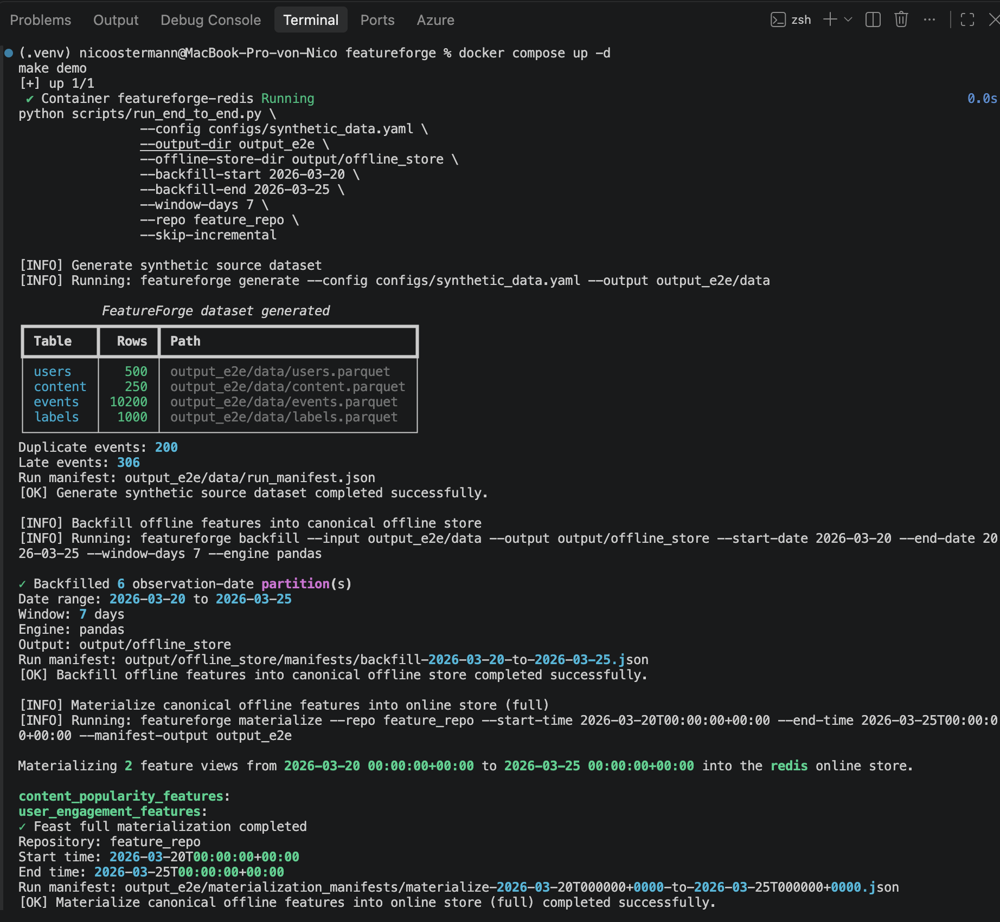
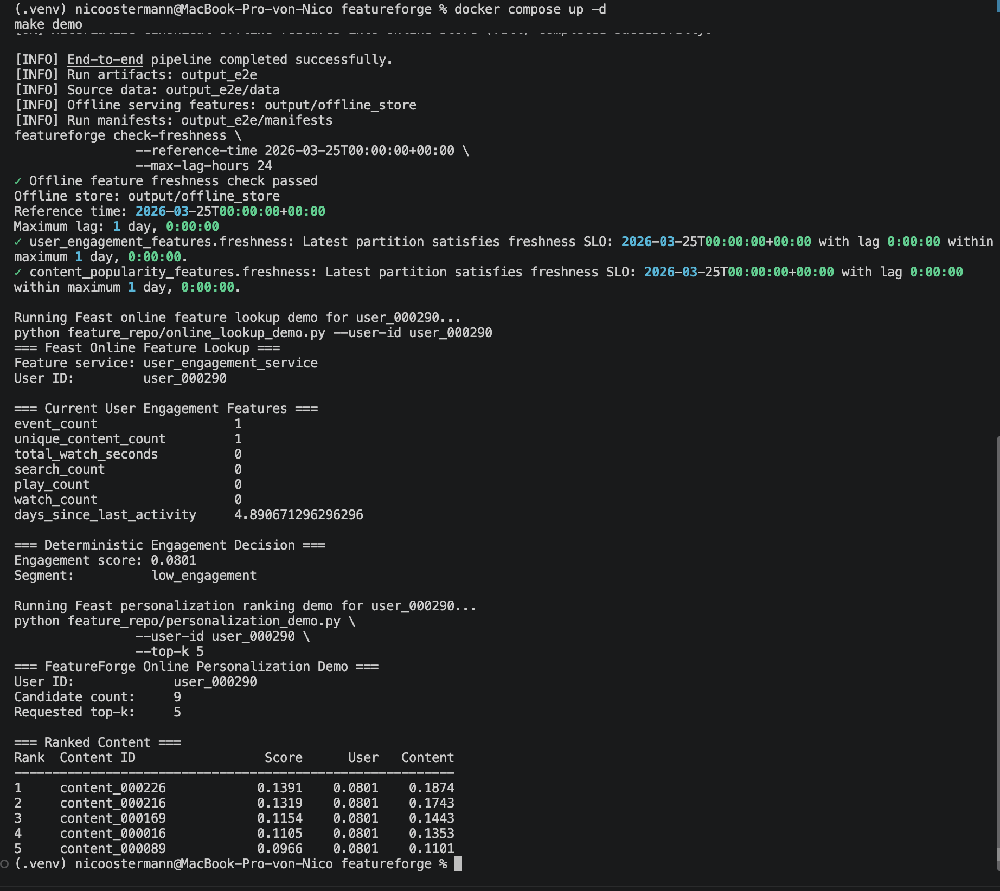
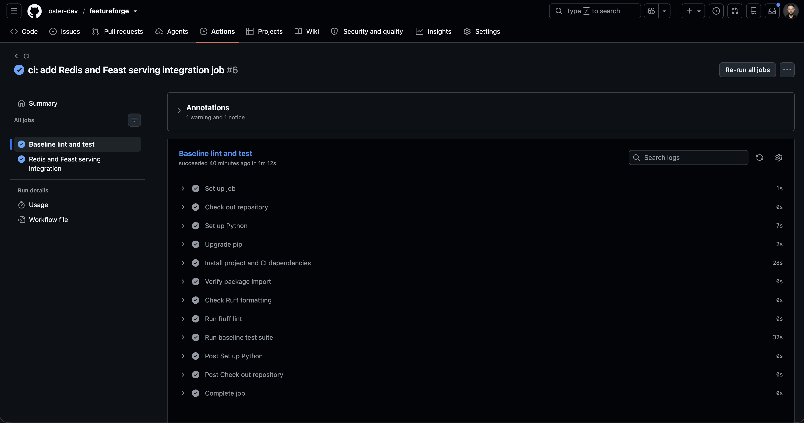
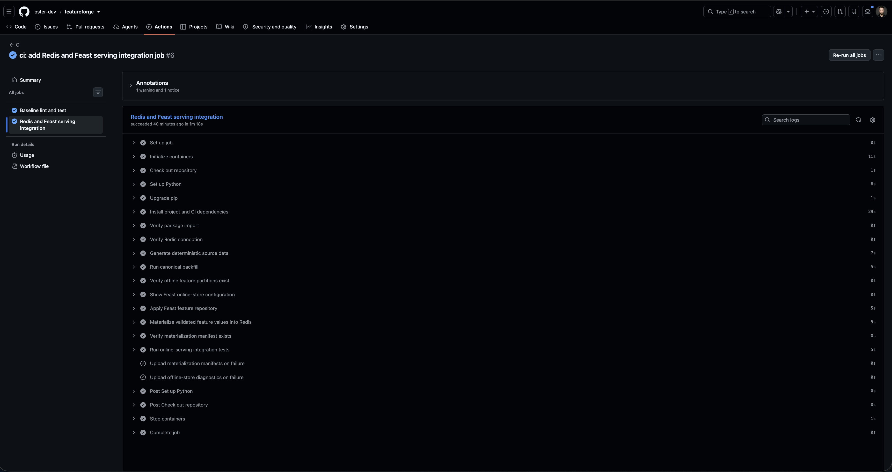

# FeatureForge Demo Guide

This guide demonstrates the local FeatureForge path from deterministic source
data to materialized online features and a deterministic content-ranking result.

It is intended for a reviewer who wants to validate the platform without
reading the full implementation first.

## What This Demonstrates

```text
synthetic source data
    → canonical offline backfill
    → persisted-feature correctness validation
    → Feast materialization
    → feature freshness check
    → Redis online serving
    → online feature lookup
    → deterministic content ranking
```

The local profile uses:

- Parquet under `output/offline_store/` as the canonical offline feature store.
- Redis through Docker Compose as the online store.
- Feast for feature definitions, materialization, and online lookup.

For the AWS production profile, see
[AWS Production Profile](aws-production-profile.md).

## Prerequisites

- Python 3.11, 3.12, or 3.13
- Docker Desktop running
- GNU Make
- FeatureForge installed with development, feature-store, and Spark dependencies

Install from a clean checkout:

```bash
git clone [https://github.com/oster-dev/featureforge.git](https://github.com/oster-dev/featureforge.git)
cd featureforge

python3 -m venv .venv
source .venv/bin/activate

python -m pip install --upgrade pip
python -m pip install -e ".[dev,feature-store,spark]"
```

## Run the Demo

Start Redis and apply the Feast feature repository before the first local
materialization:

```bash
docker compose up -d

cd feature_repo
feast apply
cd ..

make demo
```

`make demo` runs the reproducible local workflow:

```text
generate deterministic source data
    → backfill canonical offline feature partitions
    → validate persisted features before materialization
    → materialize validated values into Redis
    → verify feature freshness
    → retrieve online user features
    → produce deterministic content ranking
```

The demo writes run-scoped artifacts to `output_e2e/` and writes canonical
serving features to `output/offline_store/`. Generated artifacts are
reproducible and are not committed to Git.

## Expected Signals

A successful run should include output equivalent to:

```text
FeatureForge dataset generated
✓ Backfilled 6 observation-date partition(s)
✓ Feast full materialization completed
✓ Offline feature freshness check passed
=== Feast Online Feature Lookup ===
=== Deterministic Engagement Decision ===
=== FeatureForge Online Personalization Demo ===
=== Ranked Content ===
```

The default demonstration data produces:

```text
500 users
250 content items
10,200 events
1,000 observation labels
6 canonical observation-date partitions
```

Exact scores are deterministic for the current data configuration, but may
change intentionally when feature definitions or generation contracts evolve.

## Local Demo Evidence

### Pipeline and materialization

The local demo generates deterministic data, creates six canonical feature
partitions, and materializes both feature views into Redis.



### Freshness and ranking

The local demo validates the freshness SLO with zero lag, retrieves online user
features, calculates an engagement decision, and returns a deterministic
top-five content ranking.



## Verify Individual Layers

Use these commands to inspect individual parts of the platform after the demo.

### Check Redis

```bash
docker exec featureforge-redis redis-cli ping
```

Expected output:

```text
PONG
```

### Verify the Canonical Offline Store

```bash
find output/offline_store -name features.parquet
```

Expected layout:

```text
output/offline_store/
├── user_engagement_features/
│   └── observation_date=YYYY-MM-DD/
│       └── features.parquet
└── content_popularity_features/
    └── observation_date=YYYY-MM-DD/
        └── features.parquet
```

### Run Serving Tests Directly

After feature values have been materialized:

```bash
pytest -v tests/integration/test_online_serving.py
```

Expected result:

```text
5 passed
```

The serving suite verifies user and content feature parity, unknown-entity
behavior, batch candidate handling, and deterministic ranking against
materialized online values.

## CI Evidence

FeatureForge validates the platform through two GitHub Actions jobs.

### Baseline lint and test

The baseline job validates a clean Python installation, package import, Ruff
formatting, Ruff linting, and the infrastructure-free test suite.



Expected result:

```text
141 passed, 5 skipped, 0 failed
```

The five skipped tests require Redis, applied Feast definitions, canonical
offline snapshots, and materialized online feature values.

### Redis and Feast serving integration

The serving-integration job provisions Redis in a clean GitHub Actions runner,
generates deterministic source data, builds the canonical offline store, applies
Feast definitions, materializes validated features, and executes the
online-serving test suite.



Expected result:

```text
5 passed, 0 skipped, 0 failed
```

The jobs deliberately have different scopes: the baseline job remains fast and
infrastructure-free, while the serving-integration job validates the full Redis
and Feast path.

## Troubleshooting

### Redis is unavailable

Confirm that Docker Desktop is running, then restart the local service:

```bash
docker compose down
docker compose up -d
docker exec featureforge-redis redis-cli ping
```

### Serving tests are skipped

The serving tests require all of the following:

- Redis is reachable.
- Feast definitions have been applied.
- Canonical partitions exist in `output/offline_store/`.
- Feature values have been materialized into Redis.

Prepare the local stack explicitly:

```bash
docker compose up -d

cd feature_repo
feast apply
cd ..

featureforge materialize \
  --repo feature_repo \
  --start-time 2026-03-20T00:00:00+00:00 \
  --end-time 2026-03-25T00:00:00+00:00 \
  --manifest-output output
```

Then run:

```bash
pytest -v tests/integration/test_online_serving.py
```

### Materialization is blocked

FeatureForge validates persisted canonical feature partitions before invoking
Feast. A blocked materialization means the correctness gate found invalid data.

Inspect the materialization manifest:

```bash
find output -path "*materialization_manifests*" -name "*.json"
```

Then follow the
[Failed Materialization Runbook](runbooks/failed-materialization.md).

## Cleanup

Stop Redis when the demo is complete:

```bash
make docker-down
```

To remove generated run artifacts before another demonstration:

```bash
rm -rf output_e2e output/source_data output/offline_store \
  output/materialization_manifests
```

Do not remove `feature_repo/data/registry.db` while Redis or Feast commands
are running. For a complete local reset, stop Redis first and then either use a
fresh checkout or deliberately re-apply the Feast repository.